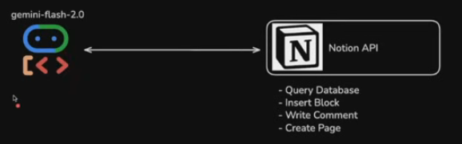
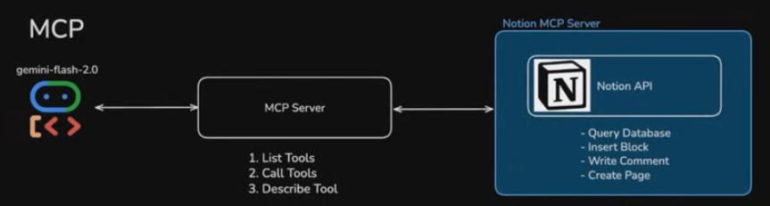

# Using MCP with Google ADK

### What is MCP?
MCP is a standard way for Agents to connect to external tools and data. More simply put, MCP is a server that is a standardized way for you to access common real-world AI tools that you want to pass to your agents. Think of an MCP server as an intermediary between your agent on the one side nd a whole list of tools on the other. For each tool, the MCP server **standardized the way** you can: 
- Get a list of all the available tools
- Describe a tool (what the tool does, what arguments it expects and what it returns) 
- Call a specific tool

To understand this better, let's understand the _traditional_ way of an Agent calling a tool:

The following diagram shows the tradional way an ADK Agent calls a Notion Tool (BTW, Notion is a productivity tool where you can write documents, create databases etc.).  

<div align="center">

</div>

In this case it would be upto _you_, the developer, to wrap every single Notion API you'd use (such as querying the database) into a tool that the ADK Agent can use. Something like the code below [NOTE: this is not an actual Notion call, just an illustration]

```python
from google.adk.agents import Agent

def query_notion_database(database_id: str, query: str):
    """Query a Notion database."""
    # Actual Notion API call would go here
    .... # your code to call the Notion API

root_agent = Agent(
    name="notion_agent",
    model="gemini-2.5-flash",
    tools=[query_notion_database],
    description="You are an AI assistant that can answer questions about your Notion database.",
    ....
)
```
This is a super-simple technique, and is the way we have been using tools with ADK in our previous examples and projects.

### Problems with traditional techniques
But the problem is:
* You'd need to write a ton of tools for every Notion API end point you want to use. Essentially write a wrapper around every API call & make that into a tool.
* You'd need to maintain all those API calls.
* Maintenance nightmare (at micro level)- imaginge _you_ have multiple ADK projects using Notion; then you'd have to duplicate the tool calls in every project (not following the DRY - or _Don't Repeat Yourself_ principle) & if you happen to make a change somewhere, you then have to back-fit into every other project!!!
* Redundancy (at macro level): similar to _your_ problem, every other developer that wishes to use the Notion API, will have to create API wrappers and similar tools in their own projects as well.

So how does MCP fix this issue?

### How does MCP fix this?
With MCP in play, this is how your agent would interact with the Notion API.

<div align="center">

</div>

In this case, we have an MCP server that _wraps_ all the end points to the Notion API and exposes _a standard interface/way_ to use all the Notion API endpoints. So _one server_ that _every AI developer anywhere_ can use across _all their projects_ without andy redundancy! Such an MCP server would typically be created by the vendor (Notion in this case) and made available to the public (not mandatory!). Under the hood that MCP server would wrap every possible API that Notion otherwise exposes to _you - the AI Developer_.

Your agent can then access this MCP server and:
- Get a list of all the available tools available
- Describe a tool (what the tool does, what arguments it expects and what it returns) 
- Call a specific tool

How does this look like in Python code?

```python
from google.adk.agents import Agent
from google.adk.tools.mcp_tool.mcp_toolset import MCPToolset, StdioServerParameters

# Create an agent that uses the MCP tool
root_agent = Agent(
    name="notion_agent",
    model="gemini-2.5-flash",
    description="You are an AI assistant that can answer questions about your Notion database.",
    tools=[
        # https://github.com/notionhq/notion-mcp-server
        MCPToolset(
            connection_params=StdioServerParameters(
                command="npx", args=["-y", "@notionhq/notion-mcp-server"]
            )
        ),
        # https://github.com/modelcontextprotocol/server-filesystem-adapter
        MCPToolset(
            connection_params=StdioServerParameters(
                command="npx", args=["-y", "@modelcontextprotocol/server-filesystem-adapter"]
            )
        ),
        # and many more....
        ...
    ],
    ....    
)
```
#### Benefits of MCP
* All of the tools that we're going to use (such as Notion, Slack etc.) are already available as MCP servers.
* We don't need to write any custom code to use these tools.
* We can use the same MCP server across multiple projects.

#### Disadvantages of MCP
* More complicated setup than traditional tools (setup customer MCP server)

### Closing Notes
Where to find MCP Serves to use:
* https://github.com/modelcontextprotocol/servers
* https://modelcontextprotocol.io/servers/
* https://smithery.ai/

Working with Notion
* https://developers.notion.com/docs/mcp
* https://github.com/makenotion/notion-mcp-server
* https://github.com/makenotion/notion-mcp-server/blob/main/docs/quickstart.md
