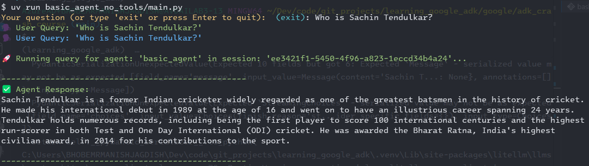
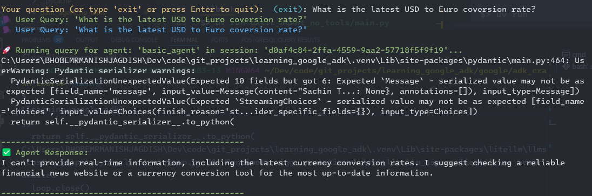

# ADK Crash Course
## Basic Agent with ADK
In this example we create a very basic agent that relies on it's LLM's pretrained knowledge to respond to user queries.

This agent will **not** be able to:
* Answer queries on the latest information, as it has no access to tools that let it search the web.
* It does not have 'memory', so it cannot remember previous questions/queries asked - each query is a standalone query to the LLM.
* In a practical setup, this example is not very useful, but it helps you get your feet wet when starting out with the Google ADK.

## Code Structure
Code has the following components:

| Module | Purpose |
| :--- | :--- |
| `agent.py` | Declares the main agent we'll use for our application |
| `agent_config.yaml` | Declares all the attributes of our agent, such as `model`, `description` and `instruction` - I prefer to externalize this rather than _'hard-code'_ into Python file |
| `utils.py` | Declates utility functions such as `load_agent_config` and `run_agent_query`, which we will use to load atr |
| `main.py` | Code to run agent from command line using `uv` command (see next section) |
| `.env` | Hold the API keys for your LLMs (Code repo will have an `.env.example` file, which is a blank file with the key names. Copy this file to `.env` and set the values of the respective keys depending on which LLM you are using!) |

## Running the code
We have two options to run the code from the command prompt:

```
adk_crash_course 
├── basic_agent_no_tools
    ├── .env    
    ├── __init__.py 
    ├── agent.py 
    ├── main.py 
    ├── ..... other files    
```

### Using `adk` command
Referring to the folder structure above (NOTE: `$>` stand for command prompt - don't type this!)

```bash
$> cd adk_crash_course
$> adk run basic_agent_no_tools
# this should display lots of messages on and then display a prompt like this
Running agent basic_agent, type exit to exit.
[user]: 
```

Following is an example of an interaction with this agent (as seen on terminal/console). 
```
[user]: Who is Sachin Tendulkar?
.... some logging info from ADK
[basic_agent]: Sachin Tendulkar is a former Indian cricketer widely regarded as one of the greatest batsmen in the history of cricket. Born on April 24, 1973, he made his debut for the Indian national team in 1989 and had an illustrious career spanning 24 years until his retirement in 2013. Tendulkar is the highest run-scorer of all time in international cricket and has numerous records to his name, including being the first to score 100 international centuries. He is also known as the "Master Blaster" and "Little Master."   

[user]: What is the latest USD to EUR conversion rate?
.... logging from ADK
[basic_agent]: I'm unable to provide real-time conversion rates. Please check a reliable financial news source or use a currency conversion tool online for the most up-to-date information.

[user]: exit

$> 
```

The responses you see could be different than the above depending on the LLM you use. Notice that for _'generic'_ questions, such as _'Who is Sachin Tendulkar'_, the LLM is able to provide a response, but it fails for question demanding most recent information.

The ADK manages a lot of things, such as creation of a session & running the user query for us - we don't have to write any code for this!!

### Using `uv` command
When you want more fine-grained control on how you run the agent, you will create a separate file, such as the `main.py` we have created. This file essentially executed the following command

1. Create a session for interaction with ADK
2. In a loop ask user for query
    * If user types `exit`, then quit the loop
    * Otherwise call `run_agent_query(...)` passing  the query the user entered
    * Display the response from `run_agent_query(...)` call to user.
3. We use the `rich.console` package to display _colorful_ text on the command line.

Here are the steps to run the code, should you choose this option:

```bash
$> cd adk_crash_course/basic_agent_no_tools
# Notice that we are running code from INSIDE the project sub-folder!
$> uv run main.py
```
Alternatively, from the `adk_crash_course` folder
```bash
$> uv run basic_agent_no_tools/main.py
```
Either call should work

The following images capture an example session with the LLM using the above command.



