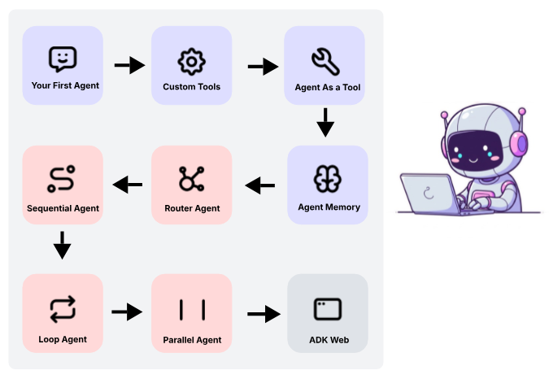

## ADK Crash Course

This is a tutorial from Google & can be found [here](https://codelabs.developers.google.com/onramp/instructions#0). I have developed it as separate Python modules (*.py files rather than Jupyter notebooks).

### Setup

```bash
# create a folder to host your code (e.g. ~/adk_crash_course)
cd ~/adk_crash_course  # replace adk_crash_course with your folder name
```
Create a `requirements.txt` file inside `~/adk_crash_course` with the following contents:

```
google-adk
google-generativeai
httpx
psutil
pydantic
python-dotenv
python-weather
pyyaml
rich
yfinance
```
Proceed with the next steps as below (to be run inside the `~/adk_crash_course` folder)
```bash
# Create a virtual environment
uv venv . --python 3.12

# Activate the virtual environment
# Windows
.venv\Scripts\activate
# Linux/Mac
# source .venv/bin/activate

# Install dependencies
uv add -r requirements.txt
```

However, if you have downloaded this code repo from Github, then you don't have to do all steps above. Just run the following:
```bash
cd ~/adk_crash_course
uv sync   
```
This will automatically create the environment for you and install all packages!


### Run the code 

```bash
# this example shows you how to run 
# any one of the files, for example 00-basic_agent.py

# follow steps below in a command/bash shell

cd ~/adk_project
# on Mac of Linux
source ~/adk_project/.venv/bin/activate
# OR (on Windows)
# .venv\Scripts\activate
uv run 00-basic-agent.py
```

### Roadmap
Following is the step-by-step roadmap we'll follow to build our competency with the [Google ADK](https://google.github.io/adk-docs/)



Here's what we'll learn:
* **A basic agent** ([00-basic-agent-no-tools.py](00-basic-agent-no-tools.py)): a basic agent that responds to user's questions based on pre-trained data only. It does not use any tools.
* **An agent using Google supplied tools** ([01-agent-with-internal-tools.py](01-01-agent-with-internal-tools.py)): an agent that plans a 1 day itinarary based on user prompt, which uses Google search tool (supplied with ADK) to get external information.
* **An agent with custom tools** ([02-agent-with-custom-tools.py](02-agent-with-custom-tools.py)): an agent that uses custom tools (i.e. a Python function we code as a tool).
* **Agent as a tool** ([03-agent-as-a-tool.py](03-agent-as-a-tool.py)): build complex systems where a primary agent, often called an Orchestrator or Router, delegates tasks to other, more focused agents.