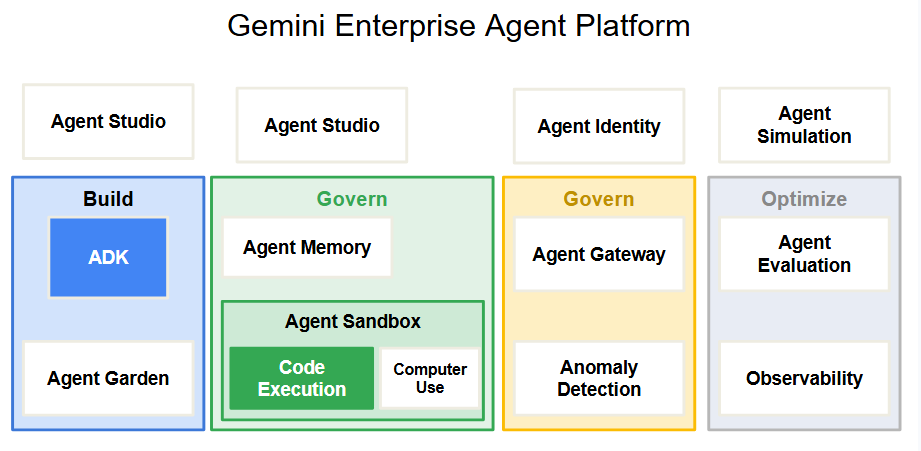
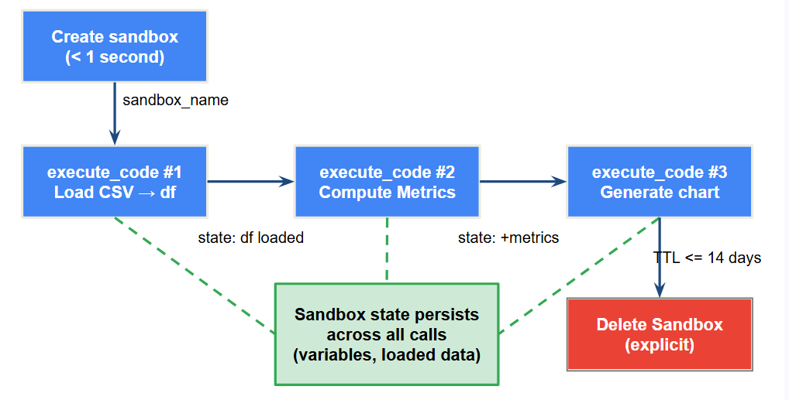
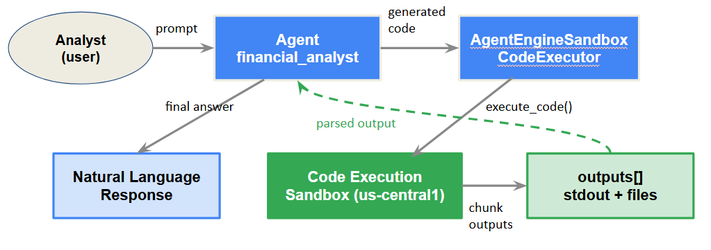

# Build Enterprise Agents with Code Execution on Gemini Enterprise Agent Platform

Source : [Google Partner Training](https://partner.skills.google/paths/4144/course_templates/1745/documents/633755)

In this document, we'll explore the Code execution feature of the Gemini Enterprise Agent Platform (formerly known as the _Vertex AI Platform_), which lets AI agents safely generate and run Python code in isolated sandbox environments. We'll see how the Agent Sandbox fits into the broader platform architecture, how to configure and operate Code Execution sandboxes using the Agent Platform SDK, and how to integrate code execution into agent workflows with the ADK.

## Gemini Enterprise Agent Platform and the Agent Sandbox

In this section we'll learn what the **Gemini Enterprise Agent Platform** is and where Code Execution fits inside it. Many agent tasks, such as complex mathematical calculations or data analysis, require an agent to generate and run untrusted code. Giving an agent the ability to run arbitraty code raises an immediate question: **Where does that code actually run**? We'll explore platform architecture and see how Agent Sandbox is designed to answer that question safely.

### The Gemini Enterprise Agent Platform

The **Gemini Enterprise Agent Platform** (previously: _Vertex AI Platform_), is Google Cloud's platform for building, scaling, governing, and optimizing AI Agents. It launched in April 2026 as the evolution of the Vertex AI Agent Builder. It consolidates model selection, agent development, and enterprise operations into one integrated platform.

The platform organized its capabilities into four areas:

| Area | Description | 
| :-- | :-- |
| **Build** | **Tools for creating agents**: **_Agent Studio_** for low-code development, the **_Agent Development Kit (ADK)_** for code-first engineering, **sub-agents** for multi-agent workflows, **_Agent Garden Templates_**, and batch and event-driven agent support. |
| **Scale** | **Infrastructure for running agents in production**: **Agent Runtime** for deployment, **Agent Memory Bank** for long-term context, **Agent Sessions** for tracking conversations, and **Agent Sandbox** for safe execution of risky operations. |
| **Govern** | **Controls for secure, compliant agent deployments**: **Agent Identity**, **Agent Registry**, **Agent Gateway**, **Agent Anamoly Detection**, **Agent Threat Detection**, and **Agent Security Dashboard** |
| **Optimize** | **Tools for improving agents over time**: Agent Simulation, Agent Evaluation, Agent Observability, and Agent Optimizer. |

All the Vertex AI services and roadmap evolutions are now delivered through Agent Platform. If you've worked with Vertex AI Agent Builder before, you'll recognize the building blocks; the platform adds the Scale & Govern layers that enterprise production deployments require.

The following diagram maps these four areas and highlights where Agent Sandbox sits within Scale:

<div align="center">

</div>

For an enterprise application, these capabilities work together:

* The **Build** tools help engineers author a portfolio-analysis agent, **Scale** runs it reliabily and safely.
* **Govern** ensures it meets the compliance requirements, and **Optimize** continuously improves it.

## The Scale area: Agent Runtime and Agent Sandbox

Within the Scale capability area, two components handle the execution side of agents: **Agent Runtime** and **Agent Sandbox**. They serve different purposes and operate in different trust domains.

**Agent Runtime**

Agent Runtime is a trusted, long-running environment where your agent's core logic executes. It deliveres sub-second cold starts and supports long running agents. This is where agent reasons, decides what actions to take, and co-ordinates with tools. Agent Memory bank handles long term context retention, while Agent Sessions tracks conversation state. Both are distinct Scale components that work alongside Agent Runtime.

An Agent Engine is the top-level container resource that owns your sandboxes. You create one before provisioning a sandbox, and it persists across the sandbox lifecycle.

**Agent Sandbox**

Agent sandbox is a short-lived, isolated environment that the agent or the platform spawns specifically to handle tasks that must not touch the agent's production infrastructure. Sandboxes operate in two modes:

* **Code Execution**: A sandboxed Python (or JavaScript) interpreter for running model-generated programs, such as computations, data analysis, chart generation.
* **Computer Use**: A sandboxed browser environment for automating web-based UI tasks, such as navigating websites of filling out forms.

These two modes serve different usecases. Code execution is for data oriented programs that operate on files and produce outputs. Computer use is for browser automation. A sandbox is ephemeral (temporary), it exists for a specific task, maintains state for upto 14 days, and is cleaned up when no longer needed.

> 🍊 **NOTE** <br/> Agent sandbox is part of the Scale area because it's about safely expanding what an agent can do in production, rather than building or governing the agent itself.

### Agent Runtime vs Agent Sandbox

Understanding the boundary between Agent Runtime and Agent Sandbox is the key conceptual point in this section. The **difference comes down to trust and isolation**.

| Agent Runtime is trusted | Agent Sandbox is isolated |
| :-- | :-- |
| Your agent's isolation logic, tool declarations, memory access and session management all run inside the runtime. These are code you wrote and control, and they go through normal security review and deployment processes. They have appropriate access to your infrastructure | When the agent decides to generate and execute (Python/JavaScript) code to answer a question such as computing a calculation, processing a file, analyzing data, it sends that code to a sandbox. The sandbox has no network addess, a limited filesystem, and no ability to affect agent runtime or any other system! |

This separation exists because model generated code is different from the code you wrote. It's synthesized on-the-fly based on user input. It can also be shaped by data the agent is analyzing. Running that code in the same environment as your production agent is a _serious security riek, which is exactly why Agent Sandbox exists._

> 💡 **Consider a Customer Service Agent** <br/> The agent might need to analyze customer data CSV files from various sources. The contents of those files contain unusual formatting or inputs that cause edge cases in generated code. Running that code in a sandbox means the worst outcome is a failed execution instead of a compromised system.


### Why isolation matters for enterprise agents

Enterprise agents operate at scale in an environment where the consequences of a security breach are significant. Three properties of the Agent Sandbox address this directly:

1. **Containment**: Code running in a sandbox cannot reach the host system's resources, filesystem, or network. A script that tries to read environment variables, reach an internal service, or install a package will simply fail. The sandbox boundary holds. This makes code execution safe to expose as a capacity even in regulated industries.
2. **Tenant Isolation**: Each sandbox is isolated from other sandboxes in the same project and from sandboxes belonging to other customers. Actions in one sandbox don't affect any other sandbox or runtime. For a multi-user platform where different analysts submit queries simultaneously, this isolation is essential.
3. **Predictability**: The pre-installed library set is fixed to over 125 packages, including `Numpy`, `Pandas`, `Matplotlib`, and `scikit-learn` with no ability to install additional packages or call external services.

What your agent can do in a sandbox is bounded and auditable. This gives security and compliance teams a clear picture of the attach surface. Together, these properties make code execution something you can deploy in production and defend to a security team. 

## Code execution deep dive: Sandboxes, state and the SDK

In this section we'll discuss how code sandboxes actually work, including the lifecycle, how state persists across calls, and how you operate them with the Agent Platform SDK. 

### The sandbox lifecycle

A code execution sandbox has a clear lifecycle. First you create it, then use it for one or many code execution calls, and eventually delete it (or let it expire on it own TTL).

1. **Create**: Creation is fast! Sanboxes initialize in under 1 second. When you create a sandbox, you give it a display name and specify the `code_execution_environment` in its spec. The sandbox is owned by an Agent Engine, which is the parent container resource that groups sandboxes and deployed agents together.
2. **Execute**: Execution is the core of the lifecycle. You send Python (or JavaScript) code to the sandbox using `execute_code`. The sandbox runs the code, returns the output, and, importantly, keeps its state for the next call. You can make as many `execute_code` calls as you need against the same sandbox.
3. **Delete**: Each sandbox has a configurable TTL (time to live) of upto 14 days. Every `execute_code` call resets the TTL, so an active sandbox stays alive as long as you're using it. When you're done, explicitly deleting the sandbox frees resources immediately. If you also no longer need the Agent Engine, deleting it with `force=True` cascades it to all its sandboxes.

The lifecycle maps naturally to a data analysis session. You create a sandbox at the start of an analysis, execute several steps of code that build on each other (load data, clean it, compute metrics, generate a chart), then cleanup when the session ends.

<div align="center">

</div>

### State Persistence and Sandbox Memory

One of the most important properties of a Code Execution sandbox is that it's stateful. Variables, imported libraries, and loaded data all persist from one `execute_code` call to the next within the same sandbox. This means you don't have to send all your code in a single call. You can build up a computation incrementally.

```python
# first call to load data
response = client.agent_engines.sandboxes.execute_code(
    name=sandbox_resource_name,
    input_data={"code": "import pandas as pd\ndf = pd.read_csv('data.csv')"},
)

# second call: compute on loaded data - df still in scope
response = client.agent_engines.sandboxes.execute_code(
    name=sandbox_resource_name,
    input_data={"code" : "returns = df.pct_change().dropna()\nprint(returns.describe())"},
)
```

**NOTE:** in the second call `df` is available because the sandbox remembers it from the first call (much like calls between Python Notebooks cells). This is what makes code execution useful for multi-step analytical workflows rather than just one-shot calculations.

> 🍊 **NOTE:** <br/> State is scoped to a sigle sandbox. Two different sandboxes don't share memory. If you create a new sandbox, you start afresh. <br/>

### Machine configuration and pre-installed library set

When you create a sandbox, you can choose its compute configuration. The default is 2 CPUs with 1.5 Gb of RAM, which is adequate for most data analysis tasks. For workloads that need more headroom, such as training a `scikit-learn` model on a large dataset, you can request larger configuration (with 4 CPUs and 4Gb RAM)

```python
sandbox_operation = client.agent_engines.sandboxes.create(
    name=agent_engine.api_resource.name,
    config=types.CreateAgentEngineSandboxConfig(display_name="data_sandbox"),
    spec={
        "code_execution_environment": {
            "code_language": "LANGUAGE_PYTHON",
            "machine_config": "MACHINE_CONFIG_VCPU4_RAM4GIB",
        }
    },
)
```

The sandbox comes with 125+ pre-installed packages. **You can't install additional libraries, but the pre-installed set is comprehensive for data science and financial analysis work.

Key packages include:

* **Data Manipulation**: Numpy 2.1.3, Pandas 2.2.3, Scipy 1.15.2
* **Machine Learning**: scikit-learn 1.6.1, XGBoost 3.2.0
* **Visualization**: Matplotlib 3.10.1, Plotly 6.1.2, Seaborn 0.13.2
* **File I/O**: openpyxl, PyPDF2

The **sandbox has no network access**. Code that attempts outbound HHTP calls or DNS lookups will fail. Combined with a fixed library set, this bounds what the sandbox can do, which is exactly what makes it safe to run model-generated code.

### The SDK operations and response structure

The vertexai client library exposes five operations for working with sandboxes. All of them are located within the `client.agent_engines.sandboxes` namespace.

1. `create` provisions a new sandbox. You pass the parent Agent Engine's resource name, a display name config, and the spec:

```python
sandbox_operations = client.agent_engines.sandboxes.create(
    name=agent_engine.api_resource.name,
    config=types.CreateAgentEngineSandboxConfig(display_name="data_sandbox"),
    spec={"code_execution_environment": {}},
)

sandbox_resource_name = sandbox_operation.response.name
```

2. `execute_code` runs code in the sandbox. You pass the sandbox resource name and an `input_data` dict containing the code string and, optionally, a files list of file dicts (each with a name and content (bytes)) that are written to the sandbox working directory before execution.

```python
# continues from previous snippet ....
sandbox_resource_name = sandbox_operation.response.name

import json

# Code execution block

# Dummy inventory data in CSV format passed as bytes
inventory_csv_data = b"""item_id,item_name,current_stock,reorder_level
INV001,Wireless Mouse,45,50
INV002,Mechanical Keyboard,12,15
INV003,USB-C Hub,85,30
INV004,4K Monitor,3,5
"""

# The script that will analyze the data inside the sandbox
code_to_run = """
import csv

print("Initializing Inventory Analysis Tool...")
restock_list = []

# Read the file that was passed into the sandbox
with open("inventory.csv", "r") as f:
    reader = csv.DictReader(f)
    for row in reader:
        current = int(row['current_stock'])
        trigger = int(row['reorder_level'])
        
        if current < trigger:
            shortage = trigger - current
            print(f"[ALERT]: {row['item_name']} is low! (Stock: {current}/{trigger})")
            restock_list.append({
                "item_id": row['item_id'],
                "item_name": row['item_name'],
                "order_quantity": shortage * 2 # Order double the shortage amount
            })

# Generate a brand new file inside the sandbox with the results
output_filename = "restock_report.csv"
print(f"Generating action report: {output_filename}")

with open(output_filename, "w", newline="") as f:
    writer = csv.DictWriter(f, fieldnames=["item_id", "item_name", "order_quantity"])
    writer.writeheader()
    writer.writerows(restock_list)

print("Analysis complete.")
"""

# Execute the code, passing the inventory file into the sandbox environment
response = client.agent_engines.sandboxes.execute_code(
    name=sandbox_resource_name,
    input_data={
        "code": code_to_run,
        "files": [
            {
                "name": "inventory.csv",
                "content": inventory_csv_data
            }
        ]
    }
)
```

The response's `outputs` list contains `Chunk` objects. Each chunk has a `data` field (raw bytes) , a `mime_type`, and optional metadata. `stdout` and `stderr` arrive as `application/json` chunks; you decode the JSON to `get msg_out` and `msg_err`. Generated files (like a chart PNG) arrive in separate chunks with a `mime_type` matching the file type and a `metadata.attributes["file_name"]` field naming the file:

```python
import json

# code from prev block
response = client.agent_engines.sandboxes.execute_code(
    name=sandbox_resource_name, ....
)

for output in response.outputs:
    # Handle standard console outputs (stdout / stderr messages)
    if output.mime_type == "application/json" and output.metadata is None:
        result = json.loads(output.data.decode("utf-8"))
        
        # Check for standard output messages
        if result.get("msg_out"):
            print(f"[Sandbox STDOUT]: {result.get('msg_out')}")
            
        # Check for error messages
        if result.get("msg_err"):
            print(f"[Sandbox STDERR]: {result.get('msg_err')}")
            
    # Handle files generated inside the sandbox (like our restock_report.csv)
    elif output.metadata and output.metadata.attributes:
        file_name = output.metadata.attributes.get("file_name")
        
        if isinstance(file_name, bytes):
            file_name = file_name.decode("utf-8")
            
        print(f"[Sandbox File Found]: Saving {file_name} ({output.mime_type})...")
        
        # Write the raw file bytes out to your local machine
        with open(file_name, "wb") as local_file:
            local_file.write(output.data)
```

`get`, `list` and `delete` complete the lifecycle operations. Use `list` to retrieve all sandboxes under an Agent Engine, `get` to fetch a single sandbox by resource name, and `delete` to remove it immediately.

## Integrating code execution into agent workflows

In this section we'll learn how to connect code execution to an ADK agent, enabling it to generate and run code autonomoysly from natural language prompts. The agent will decide when to write code, run it in the sandbox, and use the results to answer the user's question(s).


### Two integration paths: Direct SDK calls and ADK orchestration

There are two ways to use Code Execution. Which one you choose depends on whether you need an agent to orchestrate the work or you're integrating Code Execution into your own application logic.

1. **Direct SDK Calls**: These are useful when you control the loop yourself. You decide when to call `execute_code`, handle the response, and pass results to the model or your own code. This fits well if you're building a custom orchestration layer or using Code Execution with a framework other than the ADK.
2. **ADK Orchestration**: Delegate the loop to an `Agent`, the code agent class in the ADK that accepts a model, instructions and optional tools or executors. You configure the agent with a code executor, and the agent handles the full cycle. It receives a user prompt, generates code, calls `execute_code`, interprets the result, and produces the final response.

### Choosing a code executor: sandbox vs built-in

ADK gives you two code execution options. The key difference is whether you use a managed, stateful sandbox, or a lightweight in-process executor.

> 🍊 **NOTE:** <br/> The below code **requires API key from Vertex AI**. The `client.agent_engines` SDK calls require access to Google Cloud / Vertex AI enterprise infrastructure, as they spin up isolated virtual container environments (the sandboxes) managed on Google's cloud servers. <br/><br/>
> They do not have permissions to provision, list, or pay for actual cloud infrastructure assets like the `agent_engines.sandboxes` resource. For that, you need a Google Cloud Platform (GCP) Project with the Vertex AI API enabled. <br/><br/>


**How to configure for Vertex AI** <br/> 
1. **Install the Google Cloud CLI**: If you don't have it, install the gcloud CLI tool on your machine. 
2. **Authenticate locally via your Terminal**: Instead of passing a raw string API key, you authenticate your local environment directly against your Google Cloud project using Application Default Credentials (ADC). <br/><br/>

```bash
# Log in to your Google Account
gcloud auth login

# Set your active Google Cloud Project
gcloud config set project <<YOUR_GCP_PROJECT_ID>>

# Generate local credentials that the Python SDK automatically looks for
gcloud auth application-default login
```

#### Execution Options

* `AgentEngineSandboxCodeExecutor`: connects the agent to a Code Execution sandbox you've already provisioned. The `sandbox_resource_name` value is the resource name returned when you created the sandbox (as seen previously). The name follows the format 

```python
"projects/{project}/locations/{location}/reasoningEngines/{engine_id}/codeSessions/{session_id}"
```

Code runs in the sandbox and is isolated, stateful across turns, with the full pre-installed library set.

```python
import os
from google import genai
from google.genai import types
from google.adk.agents import Agent
from google.adk.code_executors.agent_engine_sandbox_code_executor import (
    AgentEngineSandboxCodeExecutor,
)

# =====================================================================
# 1. SETUP & AUTHENTICATION
# =====================================================================
# Ensure your Google GenAI Client is initialized with appropriate credentials
client = genai.Client(
    vertexai=True,
    project="<<YOUR_GCP_PROJECT_ID>>",
    location="us-central1" # Or your preferred Vertex AI region
)

# =====================================================================
# 2. PROVISION THE INFRASTRUCTURE (SANDBOX)
# =====================================================================
# The Agent Engine Sandbox Code Executor requires an active sandbox resource name.
# Here we spin up the sandbox that our financial agent will use to run its code.
print("Provisioning secure data sandbox for the Financial Agent...")
sandbox_operation = client.agent_engines.sandboxes.create(
    # Associating it with your main engine deployment
    # in the name string below replace values within << >> with your 
    # actual values (for example: <<YOUR_LOCATION>> with us-central1
    name="projects/<<YOUR_GCP_PROJECT_ID>>/locations/<<YOUR_LOCATION>>/agentEngines/<<YOUR_ENGINE_ID>>",
    config=types.CreateAgentEngineSandboxConfig(display_name="finance_sandbox"), 
    spec={"code_execution_environment": {}},
)

# This is the exact variable your snippet was missing:
sandbox_resource_name = sandbox_operation.response.name
print(f"Sandbox created successfully: {sandbox_resource_name}\n")

# =====================================================================
# 3. DEFINE THE AGENT WITH THE CODE EXECUTOR
# =====================================================================
# Now we pass that live sandbox resource name into your Agent initialization
agent = Agent(
    model="gemini-flash-latest",
    name="financial_analyst",
    description="Analyzes portfolio data using code execution",
    instruction="You are an expert financial analyst. Use code to compute metrics.",
    code_executor=AgentEngineSandboxCodeExecutor(
        sandbox_resource_name=sandbox_resource_name,
    ),
)

# =====================================================================
# 4. EXECUTE AN AGENT RUN (REAL-WORLD TEST USE CASE)
# =====================================================================
# Providing some raw text data for a portfolio and asking a math question
portfolio_data = """
Ticker,Shares,Purchase_Price,Current_Price
AAPL,50,150.00,185.00
GOOG,30,120.00,175.00
TSLA,10,250.00,180.00
"""

user_prompt = f"""
Here is my current portfolio data:
{portfolio_data}

Please write and run a Python script in your sandbox to calculate:
1. The total current value of my portfolio.
2. The total profit or loss amount.
Summarize the results for me.
"""

print("Sending financial request to Agent...")
# Run the agent (this invokes the LLM, which automatically realizes it needs
# to use the CodeExecutor to solve the math, generates Python, runs it in your 
# sandbox, reads the output, and responds).
response = agent.run(user_prompt)

# Print the final compiled response from your Financial Analyst
print("\n=== Financial Analyst Response ===")
print(response.text)
```

* `BuiltInCodeExecutor`: Runs code in the same process as your agent, without a sandbox. It's easier to setup and has no region restrictions, but **it doesn't provide isolation and doesn't persist state across turns**. Use it for development or low-risk use-cases where isolation is not required.

```python
import os
import asyncio
from dotenv import load_dotenv

from google import genai
from google.adk.agents import Agent
from google.adk.code_executors import BuiltInCodeExecutor
from google.adk.sessions import SessionRunner

# load API key from local .env file - this can be one generated 
# from Google AI Studio
load_dotenv(override=True)

# Initialize the standard GenAI Client
client = genai.Client()

# 2. Define the Agent utilizing BuiltInCodeExecutor
agent = Agent(
    name="financial_analyst",
    # Note: Built-in code execution shines on Gemini 2.0+ models
    model="gemini-flash-latest", 
    description="An assistant that solves math and financial problems using code.",
    instruction="You are an expert financial analyst. Always write and run Python code to calculate precise financial metrics.",
    code_executor=BuiltInCodeExecutor(),
)

# 3. Create an execution function to run the agent asynchronously
async def run_analysis():
    # SessionRunner handles state tracking and conversation context for the ADK agent
    runner = SessionRunner(agent=agent, client=client)
    
    prompt = "Calculate the compound interest on a $10,000 principal at an annual interest rate of 6.5% compounded monthly for 5 years."
    
    print(f"User: {prompt}\n")
    print("Analyst is thinking (and writing code implicitly)...")
    
    # Run the agent stream. BuiltInCodeExecutor tells Gemini to generate code, 
    # execute it natively on Google's backend, and feed the math back into itself.
    async for event in runner.run_async(
        user_id="dev_user", 
        session_id="session_001", 
        new_message=prompt
    ) or []:
        # When the agent finishes executing code and thinking, 
        # it yields its final text response
        if event.is_final_response() and event.content:
            print("\n=== Financial Analyst Response ===")
            print(event.content.get_text())

# Run the asynchronous function
if __name__ == "__main__":
    asyncio.run(run_analysis())
```

> 🍊 **NOTE:** <br/> For production enterprise deployments, where model-generated code runs against real data, use `AgentEngineSandboxCodeExecutor`. For local development & prototyping, use `BuiltInCodeExecutor` as it is faster to setup. <br/><br/> This option **works when you have an Gemini API key generated using Google AI Studio**. Does not need Vertex AI.

The following diagram illustrates the ADK agent integration flow. The user prompt passes through the `Agent` to the `AgentEngineSandboxCodeExecutor` to invoke the Code Execution sandbox. The results are then routed back through the agent to the user.

<div align="center">

</div>

> 🍊 **NOTE:** <br/> `AgentEngineSandboxCodeExecutor` **requires a sandbox in the `us-central1` location. This is the only location where Code Execution infra has been currently deployed (as of June 2026). Using another region will result in configuration errors at runtime. **Make sure that your Agent Engine AND sandbox are in the `us-cental1` region. <br/><br/>

### Runner Setup and multi-agent patterns

Once you have an agent configured with a code executor, you run it through a `Runner`. The `Runner` wires together the agent, session management, artifact storage, and memory. The ADK separated these concerns into distinct service objects. The `InMemory` variants store data in process memory, which is suitable for development and testing ONLY! They don't persist data across process restarts.

```python
from google.adk.runners import Runner
from google.adk.sessions import InMemorySessionService
from google.adk.artifacts import InMemoryArtifactService
from google.adk.memory import InMemoryMemoryService

APP_NAME = "financial_analysis_app"
USER_ID = "fin_analyst_007"
SESSION_ID = "session_001"

session_service = InMemorySessionService()
await session_service.create_session(
    app_name=APP_NAME, user_id=USER_ID, session_id=SESSION_ID,
)

runner = Runner(
    agent=agent,
    app_name=APP_NAME,
    session_service=session_service,
    artifact_service=artifact_service,
    memory_service=memory_service,
)
```

You send a message to the `Runner` using `run_async`, which yields events as the agent works. Events arrive in sequence (such as the agent generating text, calling tools, running code etc.) and the final event carries the agent's synthesized answer. You can use `is_final_response()` to identify this final event.

```python
from google.genai import types

async for event in runner.run_async(
    user_id=USER_ID,
    session_id=SESSION_ID,
    new_message=types.Content(role="user",
        parts=[types.Part(text="Analyze this dataset and compute the mean values")],
    ),
):
    if event.is_final_response():
        print(event.content.parts[0].text)
```

In multi-turn conversation, the sandbox's state persists. If the agent loaded your CSV in the first turn, it can compute metrics on that data in the second turn without reloading it. The agent's decision automatically manages this entire cycle.

It receives the message, determines that code execution is needed, generates Python code, passes code to the executor, captures the result back as context, and incorporates it into its response. The session service tracks the conversation context while the sandbox tracks the execution state.

### Cleaning Up Resources

Agent Engine sandboxes and Agent Engines themselves are billable resources. Building in explicit cleanup ensures that you do not leave resources running after session ends.

Delete the sandbox directly when you no longer need it.

```python
client.agent_engines.sandboxes.delete(name=sandbox_resource_name)
```

If you want to remove the Agent Engine and all the sandboxes under it in one step, use `force=True`

```python
agent_engine.delete(force=True)
```

Wrap your agent session in a `try/finally` block so cleaup runs even if the session raises an exception. In a production system, you might also implement a periodic cleanup job that lists sandoxes and deletes any that have been idle longer than your session timeout.

In a typical enterprise application, sandboxes are provisioned at the start of a user session and cleaned up when the session closes. Cleanup happens explicitly by the application, or by the sandbox TTL if application exits unexpectedly.

