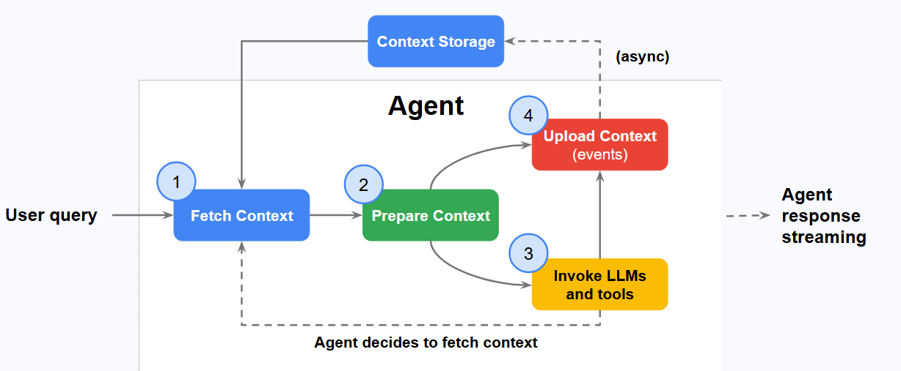
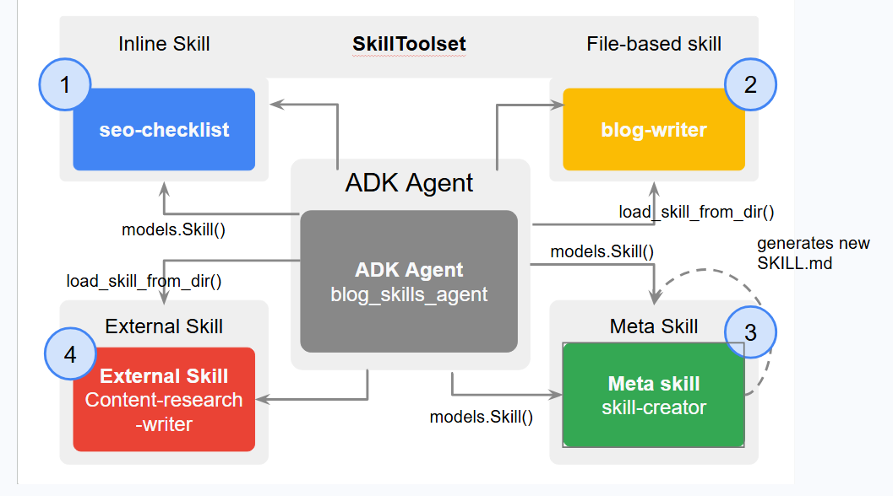
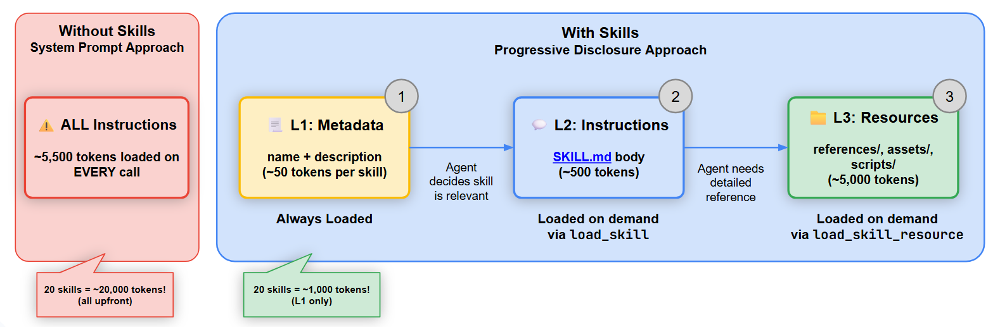
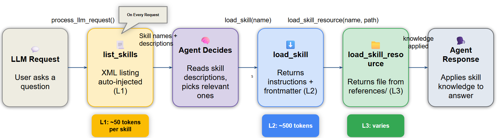

# Craft Agents with Persistent Memories

LLMs are inherently stateless, meaning their awareness is confined to the limited "context window" of a single API call. This makes building intelligent AI agents difficult. They require continuous access to operating instructions, factual data, and immediate conversational context to function effectively.

**So what's the solution?**

**Stateful and personal AI - starting with _context engineering_**. To create stateful agents that remember, learn, and personalize interactions, developers must build this context for every single conversational turn. This process - context engineering - evolves beyond static prompt engineering by dynamically assembling a state-aware prompt using data, conversation history, and external knowledge. Context engineering plays a critical role in creating powerful, personalized, and persistent AI experience. 

There are two major components that make this happen:

1. **Sessions**: The immediate container for an entire conversation, holding chronological history of the dialog and the agent's turn-by-turn working memory.
2. **Memory**:  The mechanism of long-term persistence, which captures and consolidates key information across multiple sessions to provude a continuous and personalized experience for the user.

## Context Engineering

LLMs are inherently stateless. Outside of their training data, their reasoning and awareness are confined to the information provided within the "context window" of a single API call. This presents a fundamental problem: AI agents must be equipped with operating instructions, factual data, and immediate conversational information to understand their current task.

To build intelligent agents that can remember, learn and personalize interactions, you must construct this context for every single turn of the conversation. This dynamic assembly and management of information is known as context engineering.

### Prompt Engineering vs Context Engineering

Context Engineering represents a necessary evolution from traditional prompt engineering. To understand the difference, consider how they handle information:

| **Prompt Engineering** | **Context Engineering** |
| :-- | :-- |
| Focuses on crafting optimal, often static, system instructions | Addresses the entire payload, dynamically constructing a state-aware prompt based on the user, conversation history and external data |


Ultimately Context Engineering involves strategically selecting, summarizing, and injecting different types of information to maximize relevance while minimizing noise. Because external systems - such as RAG databases, session stores, and memory managers - hold much of this context, your agent framework must constantly orchestrate these systems to retrieve and assemble the final prompt.

The goal of context engineering is to ensure that the model has no more an dno less than the most relevant information to complete the task.

### Analyze the anatomy of Context

To achieve this "perfect recipe" it's helpful to understand what ingredients go into the context window. Context Engineering governs the assembly of complex payload that can include a variety of components, which can be broken down into three categories:

1. **Context Guide Reasoning**: This category defines the agent's fundamental reasoning patterns and available actions, dictating its behavior:
    
    * **System Instructions**: High-level directives defining the agent's persona, capabilities, and constraints.
    * **Tool definitions**: Schemas for APIs or functions the agent can use to interact with the outside world.
    * **Few-shot examples**: Curated examples that guide the model's reasoning process via in-context learning.

2. **Evidential and factual data**: This is the substantive data the agent reasons over, including pre-existing knowledge and dynamically retrieved information for the specific task; it serves as the 'evidence' for the agent's response.

    * **Long-term memory**: Persisted knowledge about the user or topic, gathered across multiple sessions.
    * **External knowledge**: information retrieved from databases or documents, often using RAG.
    * **Tool outputs**: The data or result returned by a tool.
    * **Sub-agent outputs**: The conclusions or results returned by specialized agents that have been delegated a specific sub-task.
    * **Artifacts**: Non-textual data (e.g., files, images) associated with the user or session.

3. **Working Context**: This final category grounds the agent in the current interaction, defining the immediate task:

    * **Conversation history**: The turn-by-turn record of the current interaction.
    * **State or scratchpad**: Temporary, in-progress information or calculations the agent uses for its immediate reasoning process.
    * **User's prompt**: The immediate question to be addressed.

### Why not include everything inside the context window?

One of the biggest challenges in building a context-aware agent is dealing with an every-growing conversation history. Although modern models _can_ handle massive transcripts, sending the entire history everytime creates two significant drawbacks:

| 1. **Increased cost and latency**| 2. **"Context Rot"**|
|:--|:--|
| Processing a massive context window takes more time and costs more money. | As the prompt gets longer, the model's ability to pay attention to the most critical information diminishes.|

Context Engineering addresses this directly by dynamically compressing history. By using techniques like summarizing older messages, or pruning irrelevant details, you preserve vital information while managing the overall token count.

### Examine the context management lifecyle

To build the right context and keep the conversation history manageable, an agent follows a structured cycle during every single turn of a conversation.

<div align="center">

</div>

1. **Fetch context**: The agent begins by retrieving context - such as user memories, RAG documents, and recent conversation events. For dynamic context retrieval, the agent will use the user query and other metadata to identify what information to retrieve.
2. **Prepare context**: The agent framework dynamically constructs the full prompt for the LLM call. Although individual API calls may be asynchronous, preparing the context is a blocking, "hot path" process. The agent cannot proceed until the context is ready.
3. **Invoke LLM and tools**: The agent iteratively calls the LLM and any necessary tools until a final response for the user is generated. Tool and model output is appended to the context.
4. **Upload Context**: New information gathered during the turn is uploaded to persistent storage. This is often a "background" process, allowing the agent to complete execution while memory consolidation or other post-processing occurs asynchronously.

### Work with persistence in ADK

We'll focus on the ADK in this course. At the center of the content management lifecycle in the ADK there are three fundmental components:

1. **Session**: Manages the turn-by-turn state of a single conversation.
2. **Memory**: Provides the mechanism for long-term persistence, capturing and consolidating key information across multiple sessions.
3. **Skills**: Enables agents to load domain expertise on demand.

Skills super-power an agent with capabilities that can be loaded on demand. These skills can evolve and change, and the agent can develop new skills as it learns. The session serves as the temporary scratchpad for a single conversation, while the agent's memory is the meticulously organized filing cabinet, allowing it to recall key information during future interactions.

### Work with persistence in Agent Platform

Gemeni Enterprise Agent Platform is a unified platform to build, deploy, govern, and optimize enterprise-grade AI agents and model-based solutions. ADK natively integrates with Agent Platform, but you can build agents without using the ADK, and still benefit from Agent Platform solutions. Regarding persistence Agent Platform includes:

1. **Agent Platform Sessions**: A managed service designed to store, query and manage hostory of interactions between a user and agent.
2. **Agent Platform Memory Bank**: A managed service that dynamically generate, persists, and provides long-term memories based on conversations between the user and your agent.
3. **Agent Platform Skills Registry**: A secure, private, and low-latency repository for managing agent skills.

Because LLMs are inherently stateless, they start completely fresh with every API call. To build intelligence, continuous experiences, you can rely on context engineering - dynamically assembling system instructions, factual data, and conversation history into an optimized prompt for every turn to prevent context rot.


## Evaluating the const implications of agent context

As you design agenta that use sessions and memory to store data across the context management lifecycle, you must also address a practical constraint: the cost of holding onto all that information.

In a simplistic architecture, a session is an immutable log of the conversation between the user and the agent. However, as the conversation scales, the conversation's token usage increases. Modern LLMs can handle long contexts, but limitations exist, especially for latency-sensitive applications:

1. **Context window limits**: Evert LLM has a maximum amount of text (context window) it can process at once. If the conversation history exceeds this limit, the API call will fail.
2. **API costs**: Most LLM providers charge based on the number of tokens you send and recieve. Shorter histories mean fewer tokens and lower cost per turn.
3. **Latency**: Sending more text to the model takes longer to process, resulting in slower response time for the user. Compaction keeps the agent feeling quick and responsive.
4. **Quality**: As the number of tokens increases, performance can get worse due to additional noise in th econtext and autoregressive errors.

### Balance cost, speed and quality

To ensure the agent carries only what it needs, developers rely on three primary strategies:

1. **Apply progressive disclosure**: This architectural pattern allows agents to load context precisely when it is needed, rather than cramming thousands of tokens into a monolithic system prompt. For example, at the beginning of the conversation, the agent is given only the rules and data it needs for Step1. Once Step1 is successfully completed, the system (or a supervisor agent) "discloses" the instructions and data for Step 2 and so on.
2. **Implement memory compaction**: One approach is to use compaction strategies to shrink long conversation histories, condensing a dialog to fit within the model's context window, reducing API costs and latency. As a conversation gets longer, the history sent to the model with each turn can become too large. Compaction strategies solve this by intelligently trimming the history while trying to preserve the most important context.
3. **Use contextual memory**: A different approach is to use memory contextually. Instead of passing all the conversational history at the start of the conversation with an agent, you can look up specific information at query time. To do so, you can use tools that access external data stores. You can form these from previous conversations with users or from external data sources. Although it's not conversational memory, the agent can have access to external knowledge retrieved. Your organization might have databases, wikis, or shared devides with specific information to make available to the user. You might want to  disclose such information on-demand when a customer has a relevant query, rather than load all that information in the inital context.

Although giving your agent _infinite memory_ might seem ideal, it quickly leads to high API costs, slow responses, and degraded reasoning. To build efficient agents, you must optimize your context window - using compaction to trim conversational histories, and relying on contextual retrieval to fetch external data only when it is strictly necessary.

## Add Skills to Agents

### What are Agent Skills?

Agent Skills are a light-weight, open-format for extensing AI agent capabilities with specialized knowledge and workflows.

At its core, _a skill is a folder_ containing a `SKILL.md` file. This file includes metadata (`name` and `description` at a minimum) and instructions that tell an agent how to perform a specific task. Skills can also bundle scripts, reference materials, templates and other resources.

```bash
my-skill/
├── SKILL.md             # REQUIRED: metadata & instructions
├── scripts/             # Optional: executable code
├── references/          # Optional: documentation
├── assets/              # Optional: templates, resources
└── ...                  # any additional files or directories
```

### Benefits of Agent Skills

Agents are increasingly capable, but often don't have the context they need to do real work reliably. Skills solve this by packaging procedural knowledge and context that is specific to the company, team and user into portable, version-controlled folders that agents load on demand. This gives agents the following:

1. **Domain Expertise**: Specialialized knowledge, such as legal review processes, data analysis pipelines, and presentation formatting captured as reuseable instructions and resources.
2. **Repeatable workflows**: Multi-step tasks turned into consistent, auditable procedures.
3. **Cross-product reuse**: Skill built once and used across any skills-compatible agent.

### Implementing Agent Skills

The ADK's `SkillToolset` enables agents to load domain expertise on demand. The `SkillToolset` achieves this through progressive disclosure. This architectural pattern allows agents to load context precisely when needed, rather than cramming thousands of tokens into a monolithic system prompt. Each pattern builds on the previous one, culminating in an agent architecture capable of dynamically expanding its own capabilities.

<div align="center">

</div>

1. **The inline checklist**: A basic, hardcoded skill implementation.
2. **The file-based skill**: Loading external instructions & resources.
3. **The skill factory**: a self-extending pattern where the agent writes new skills on demand.
4. **The external import**: Utilizing community-driven skill repositories.

### Analyzing the problem with monolithic prompts

Most AI Agente get their domain knowledge directly from the system prompt. Developers often concatenate compliance rules, style guidelines, API references, and troubleshooting procedures into one massive instruction string - yes, I am guilty of this too!

This works fine when an agent only has two or three capabilities. However, once you scale upto 10 or more tasks, concatenating all of those instructions into the system prompt will cost you thousands of tokens on every LLM call. This happens regardless of whether the user's specific query actually requires that knowledge or not.

The [Agent Skills specification](https://agentskills.io/specification) solves this through progressive disclosure. It breaks knowledge loading into three distinct levels: **L1 metadata**, **L2 instructuons**, and **L3 resources**.

<div align="center">

</div>

1. **L1 Metadata (~100 tokens per skill)**: This includes just the skill name & description. It is _always loaded at startup for all skills_ and acts as a menu the agent scans to decide what is relevant.
2. **L2 Instructions (<5,000 tokens)**: This is the entire skill body. It is loaded via the API _only when the agent explicitly activates specific skill_.
3. **L3 Resources (as needed)**: These are external reference files, such as style guides, API specs. They are _loaded only when the skill's instructions require them_.

By using this architecture, an agent with 10 skills starts each call with roughly 1,000 tokens (= 10 * 100) of L1 metadata instead of 10,000 tokens in a monolithic prompt. This translates to ~90% reduction in base context usage! The ADK implements this through the `SkillToolset` class, which auto-generates these tools:

* `list_skills` (L1)
* `load_skill` (L2)
* `load_skill_resources` (L3)

### Implement progressive disclosure

To implement progressive disclosure in your agent, the `SkillToolset` supports four distinct patterns. These patterns range from simple static rules to advanced, self-extending architectures. As you move from the first pattern to the fourth, your agent gains increasing autonomy over its own knowledge base.

1. **Pattern 1: Inline skills (the sticky note)**

    The simplest pattern: a Python object with `name`, `description` and `instructions`, defined directly in your agent code. This is best for small, stable rules that rarely change.

    ```python
    # ADK pseudocode
    from google.adk.skills import models

    seo_skill = models.Skill(
        # frontmatter = L1 metadata (always loaded)
        frontmatter=models.FrontMatter(
            name="seo-checklist",
            description="""
                SEO optimization checklist for blog posts. Covers
                title tags, meta descriptions, heading structure,
                and readability.
            """,
        ),
        # instructions = L2, loaded when agent decides this skill is relevant
        instructions=("""
            When optimizing a blogpost for SEO, checkk each item:
            1. Title: 50-60 chars, primary keyword near the start.
            2. Meta description: 150-160 chars, includes a call-to-action.
            3. Headings: H2/H3 hierarchy, keywords in 2-3 headings.
            4. First paragraph: Primary keyword in first 100 words.
            5. Images: Alt text with keywords, compressed, descriptive names.
            Review the content against each item and suggest improvements.
            """,
        ),
    )
    ```

    The `frontmatter` fields become the L1 metadata, which the LLM sees in every call. The `instructions` becomes L2, loaded only when the agent decides the skill is relevant. When asked "Review my blogpost for SEO:, the agent will load this skill and apply each item systematically.

2. **Pattern 2: File-based skills (the reference binder)**

    Inline skills work for simple checklists. But if your skill needs reference documents (e.g. a style guide, API reference etc.), you need a directory.

    A file-based skill lives in its own directory with a `SKILL.md` file and optional subdirectories for references, assets, and scripts. The `SKILL.md` starts with YAML formatter, followed by Markdown instructions.

    ```bash
    skills/blog-writer/
    ├── SKILL.md               # REQUIRED: L2 instructions
    └── references/    
          └── style-guide.md   # L3: loaded on demand    
    ```

    This design splits knowledge across two layers. The `SKILL.md` instructions (L2) tells the agents what steps to follow. The `references/style-guide.md` file (L3) provides detailed domain knowledge for each step. The agent loads the reference only when its instructions dictate it via the `load_skill_resources` tool.

    ```python
    # ADK pseudocode
    from pathlib import Path
    from google.adk.skills import load_skills_from_dir

    blog_writer_skill = load_skill_from_dir(
        pathlib.Path(__file__).parent / "skills" / "blog-writer",
    )
    ```

    File based skills make knowledge reuseable. Ant agent that follows the Agent Skills specification can load the same directory. But in this scenario, you still write the `SKILL.md` file yourself.

3. **Pattern 3: External Skills (the import)**

    External skills work exactly like file-based skills. The only difference is where the directory came from. Instead of writing your own `SKILL.md` file, you download one from a community repository like [awesome-claude-skills](https://github.com/ComposioHQ/awesome-claude-skills) and load it with the same `load_skill_from_dir` call.

    ```python
    # ADK pseudocode
    from pathlib import Path
    from google.adk.skills import load_skills_from_dir

    content_researcher_skill = load_skills_from_dir(
        pathlib.Path(__file__).parent / "skills" / "content-research-writer",
    )
    ```

    This code is identically to pattern 2. The `agentskills.io` spec defines a universal directory format, so `load_skill_from_dir` doesn't care whether you wrote the `SKILL.md` file or downloaded it. Google publishes official ADK development skills as part of [Agentc CLI](https://google.github.io/agents-cli/guide/getting-started/#getting-started) installable via `uvx google-agents-cli` setup.

4. **Pattern 4: The skill factory (meta skills)**

    **The first 3 patterns cover skills that already exist, ones you write or ones you find. In this pattern, the agent writes its own skills.**

    A meta-skill is a skill whose purpose is to generate a new `SKILL.md` files. An agent equipped with a meta skill becomes self-extending. It can expand its own capabilities without human intervention by writing & loading new skill definitions at runtime.

    The skill creator is an inline skill whose instructions explain how to write a valid `SKILL.md` files. The key is the `resources` field. It embeds the `agentskills.io` specifications itself and a working example as L3 reference. When asked to create a new skill, the agent reads these references and generates a spec-compliant `SKILL.md`.

    ```python
    # ADK pseudocode
    from google.adk.skills import models

    skill_creator_skill = models.Skill(
        frontmatter=models.FrontMatter(
            name="skill-creator",
            description="""
                Creates new ADK-compatible skill definitions from requirements.
                Generates a complete SKILL.md files following the Agent skills
                specification at agentskills.io.
            """,
        ),
        instructions=("""
            When asked to create a new skill, generate a complete SKILL.md file.
            Read 'references/skill-spec.md' for the format specification.
            Read 'references/example-skill.md' for a working example.
            Follow these rules:
            1. Name must be kebab-case, max 64 characters.
            2. Description must be under 1024 characters.
            3. Instructions should be clear, step-by-step.
            4. Reference files in references/ for detailed domain knowledge.
            5. Keep SKILL.md under 500 lines, put details in reference.
            6. Output the complete file content the user can save directly
            """),
        resources=models.Resources(
            references = {
                "skill-spec.md": "# Agent skills Specification (agentskills.io)...",
                "example-skill.md": "# Example: Code review skill...",
            }
        ),
    )
    ```

    The resource field is where the `models.Resources` class becomes essential. The references embed the `agentskills.io` spec as `skill-spec.md` and a working code review skill as `example-skill.md`. When the agent calls `load_skill_resource("skill_creator", "references/skill-spec.md")`, it gets the full specification that governs how valid skills are structured.

    **Best Practice for generating skills:** Although auto-generating skills is a powerful workflow, it's recommended using a human-in-the-loop to review the final `SKILL.md`. As a standard practice for _any_ skill you build, you should test its effectiveness. You can easily do this by building a robust [evaluations with ADK](https://google.github.io/adk-docs/evaluate) to ensure that your skill works exactly as intended before deployment.

### Use the skill factory

As the agent "I need a new skill for reviewing Python code for security vulnerabilites".

The agent will load the skill creator, read the spec and example via `load_skill_resource`, and generate a complete Python security review skill with the vaid kebab-case naming, structured instructions covering input validation, authentication, and cryptography, and security based report format.

The generated skill follows the same `agentskills.io` spec, so it works not just in ADK byt in any compatible agent: Gemini CLI, Claude Code, Cursor etc.

### Assemble the Skill toolset

<div align="center">

</div>
    
With all the four skills defined, packaging them into a `SkillToolset` and handling it to the agent takes a few lines of code:

```python
skill_toolset = SkillToolset(
    skills=[seo_skill, blog_writer_skill, content_researcher_skill, skill_creator]
)

agent = Agent(
    model="gemini-flash-latest",
    name="blog_skills_agent",
    description="A blog-writing agent powered by reuseable skills",
    instruction=("""
        You are a blog writer assistant with specialized skills.
        Load relevant skills to get detailed instructions.
        Use load_skill_resource to access reference materials.
        Follow each skills step-by-step instruction.
        Aways explain which skill you're using and why.
    """),
    tools=[skill_toolset],
)
```

The first three skills in the list handle SEO, writing & research. The fourth - `skill_creator`, is teh factory. Ask this agent _"Create a skill for writing technical blog introductions"_ and it generates a new `SKILL.md` on the spot.

```yaml
# generated by skill-creator
---
name: blog-intro-writer
description: Writes compelling technical blog introductions. Hooks the reader
 with a problem statement, establishes relevance, and previews what they will learn.
---

When writing a blog introduction, follow this structure:
1. Open with a specific problem the reader recognizes.
2. State why it matters now (new release, scaling pain, common mistake)
3. Preview what the post covers in one sentence
4. Keep it under 100 words.
```

The agent uses `seo-checklist` and `blog-writer` skills for existing tasks. When it needed a capacity it did not have, it wrote one. That new skill follows the same `agentskills.io` spec, so you can save it to `skills/blog-intro-writer/SKILL.md` and load it with `load_skills_from_dir` in  your next session.

### Review Best Practice

<< continue from here...>>