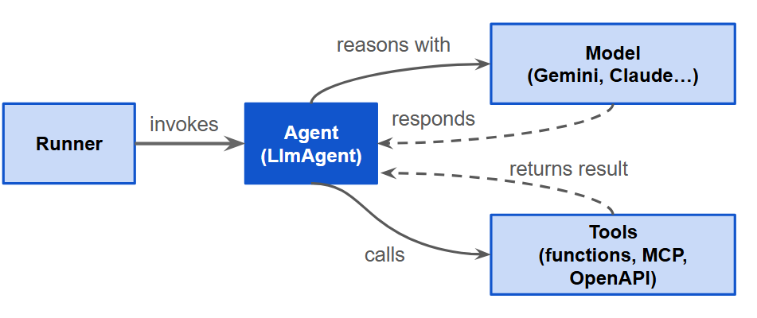
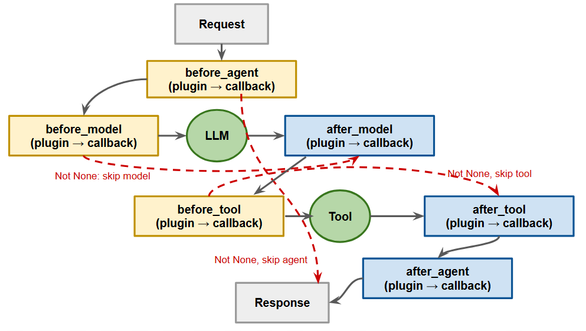
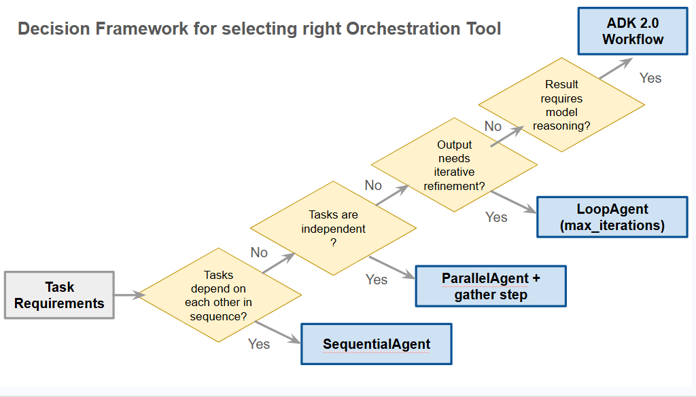
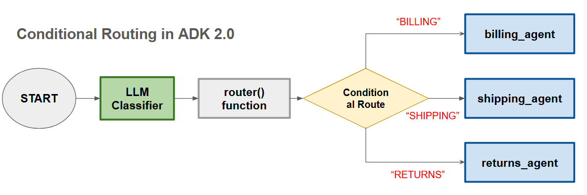
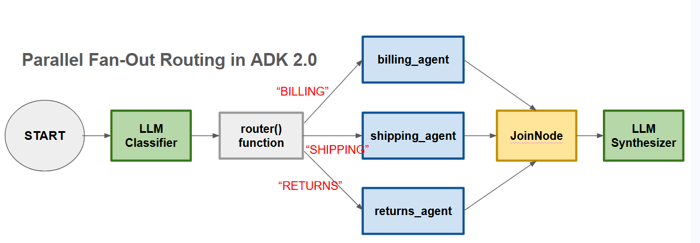
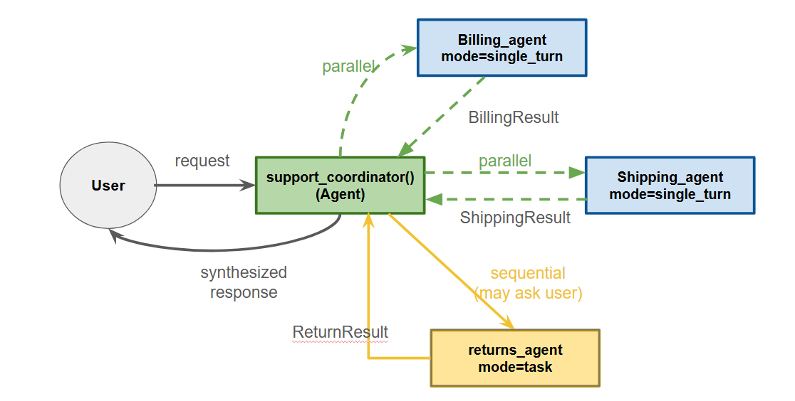
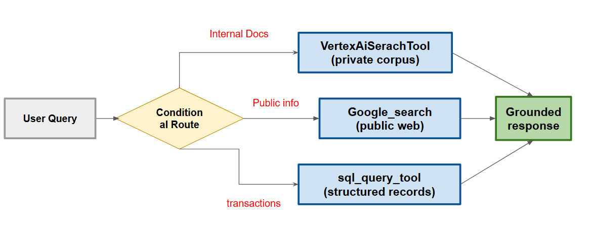

# Build Agents with the ADK

## Agent, tools, and runners: The ADK model
In this section we'll discover what the Google Agent Development Kit (ADK) is, what are its core components, how they fit together, and how to configure and run a simple agent.

### What is the ADK and where it fits

The ADK is Google's open source framework for building, debugging, evaluating and deploying AI agents at enterprise scale. It provides a structured, production-grade layer over the model APIs (such as the OpenAI API or Google Gen AI API or Anthropic API). This allows you to focus on designing the agent's behavior, rather than wiring up boilerplate.

ADK supports Python, TypeScript, Go, Java and Kotlin. Feature availability varies across language implementations, and _Python is the most complete implementation_. The **ADK is model-agnostic**, meaning that you can 'point it' at Gemini, Claude, OpenAI, Ollama, or _any provider supported by  LiteLLM_ (an opensource library, which provides a unified interface to dozens of model providers). You can swap models without rewriting your agent logic.

The key distinction from call model API directly is orchestration. When you call a model API directly, you handle context assembly, tool dispatch, retry logic, and state management yourself. The _ADK handles all that infrastructure_, so your code expresses what an agent does, not how the runtime manages it.

Select the ADK of your task required one or more of the following:

| Feature | Description |
| :-- | :-- |
| **Managed Tool**<br/>(or, Specialized Agent Tooling) | Your agent relies on external functions, requiring automatic schema generation from Python signatures, access to shared session state via **ToolContext**, or integration with MCP and OpenAI servers. |
| **Multi-step Workflows**<br/>(or, Multi-step Reasoning) | The system executes a sequence of decisions or transformations that don't fit in a single prompt. |
| **Multi-agent Collaboration**<br/>(or, Orchestration & Collaboration) | Specialized agents work together on a large problem |
| **Production Operations**<br/>(or, Production Reliability) | The system handles observability, evaluation, and deployment at scale. |

To illistrate the technical requirements, consider a production-grade customer support system configured to manage billing anamolies, order tracking, and returns. This domain exemplifies the core operational challenges of the framework through several key patterns:

| Feature | Description |
| :-- | :-- |
| **Managed Tool**<br/>(or, Specialized Agent Tooling) | Dedicated macro agents utilize specialized tools and APIs to query and mutation-test backend systems. |
| **Multi-step Workflows**<br/>(or, Multi-step Reasoning) | Incoming customer requests are complex and require sequential, multi-layered reasoning steps to resolve. |
| **Multi-agent Collaboration**<br/>(or, Orchestration & Collaboration) | Multiple specialist agents operate autonomously under the governance of a centralized coordinator agent. |
| **Production Operations**<br/>(or, Production Reliability) | The entire architecture is engineered to execute deterministically, reliabily, and at scale within a production environment.|

### Components of the ADK

The ADK organizes everything around four core components: **Agents, Models, Tools, and the Runner**. 

* **Agents**: Agents are autonomous units of work that receive a task, decide which actions to take, optionally use tools, and return a result. ADK's primary agent type is `google.adk.agents.Agent` (also called `LlmAgent`), which uses a language model (such as Gemini, Claude etc.) as its reasoning agent.

  The ADK also provides **workflow agents** types that orchestrate other agents _without using a model_ making the orchestration decision. **SequentialAgent** runs sub-agents one after another, **LoopAgent** runs them concurrently, and **LoopAgent** repeats a sub-agent until some condition is met.

* **Models**: Models are the language models that power agent reasoning. You specify a model but its identifier string (e.g. `model="gemini-2.5-flash"`), and the ADK handles the API calls, token management, and response parsing. You could use a different model per-agent, so different agents in the same system can use different models based on capability and cost.

* **Tools:** Tools extend what an agent can do. A tool is any Python function you pass to an agents **tools** list (e.g., `tools=[get_weather, get_time]`). ADK will use the function's name, docstring, and parameter types to build the tool schema. The model reads that schema to know when and how to call the tool.

  The ADK also supports advanced integrations, like OpenAPI and Model Context Protocol (MCP) tools.

* **Runner:** The runner ties it all together. When you call `adk run` or `adk web`, the ADK instantiates a _local_ runner. This runner manages the event loop, routes user messages to the correct agent, dispatches tool calls, and streams results back. When you are ready for Production, this exact same runner sits behind the API server you deploy to Cloud Run or the Google Kubernetes Engine (GKE).

The following diagram shows you how these 4 components interact with each other - the agent sits at the center and draws on the model (LLM) for reasoning.

<div align="center">

</div>

### Configuring a simple agent

An **Agent** in the ADK requires 3 things to work: 
* A **name**
* A **model**
* and an **instruction**

Everything else is optional, but shapes how the agent behaves in a multi-agent system.

Here is an example of a minimalistic agent:

```python
from google.adk.agents import Agent

# dummy function representing a tool
def lookup_account(account_id: str):
  """retrieves the current balance and status of a given billing account.

  Args:
    account_id: The unique identifier for customer account.
  Returns:
    dict: The account details, or an error status if not found
  """

  # NOTE: the doc-string of a tool function is very important
  # be as descriptive as possible about what the function does, describe ALL parameters (args) and return value.
  # These details will help agent figure out which tool to call, with what params and for what purpose

  return query_billing_database(account_id)

billing_agent = Agent(
  name="billing_agent",
  model="gemini-flash-latest",
  instruction="""
    You are a billing specialist. Answer the questions 
    about account balances, payments histories and invoices.
  """,
  tools=[lookup_account],
)

```

In this example, `lookup_account` is a Python function that queries a billing database to fetch billing details given an account ID.

Parameters of the `Agent` constructor:

* The **name** must be a _unique string identifier_. In a multi-agent system, the name is how a co-ordinator agent refers to this specialist agent when delegating tasks. So choose names that describe the agents role. This name must confirm to Python variable naming conventions.
* The **model** is the model identifier string. The ADK resolves this to the correct API endpoint. We have used `"gemini-flash-latest"`, which is a technique of future-proofing model aliases. Model strings are intrinsically version-specific (for example, `gemini-2.5-flash`), but using the `latest` alias ensures that the system automatically resolves that to the current recommended Flash model. For example, as of June 2026, `"gemini-flash-latest"` will automatically resolve to `"gemini-3.1-flash"`.
* The **instruction** is the most important parameter. **It's the system prompt that defines the agent's persona, its scope, its constraints, and any guidance for tool use**. A well written instruction keeps the agent on task and prevents it from attempting things outside its responsibility/remit. Keep the instruction very specific - an agent that knows exactly what it handles, and what it doesn't, behaves more reliably.
* The **tools** list contains functions the agent can call. The ADK wraps each function automatically, using its docstring and type hints as the tool schema - hence it's important to define very clear & detailed doc strings and type hints for parameters (and return types, where possible). The model will read that schema to decide when and how a tool should be invoked.

These **additional 3 parameters** are worth knowing, especially if you are going to develop multi-agent systems:

* The **description** is a _concise summary of what the agent does_. In a multi-agent system, a co-ordinator (agent) reads this description to decide which specialist (sub-agent) to route a task to. **If you plan to use this agent as a sub-agent, write the description as a single sentence that clearly states the agents scope**. For example `"A billing agent to query account balances, payment histories and invoices"`.
* The **output_key** is an optional string. When set, the ADK writes this agent's final response into a session state under that key, making it available to downstream agents in a workflow. For example, setting `output_key="billing_response"` lets a downstream aggregator agent read the billing result without the co-ordinator needing to pass it explicitly.
* The **output_schema** is an optional string. When you are _forcing_ the agent to produce output in a structured format (for example as a JSON object or Pydantic `BaseModel` derived class), you should use `output_schema` instead of `output_key`. However, `output_schema` is incompatible with tools on some models, so check the model-specific documentation before combining them in a single agent. This is a known problem with Anthropic Claude models (Claude 3, 3.5, and 4.6 Sonnet) and Gemini Flash 1.5 Flash and earlier models for example.

Here is the agent definition with all these new parameters:

```python
from google.adk.agents import Agent

billing_agent = Agent(
  name="billing_agent",
  model="gemini-flash-latest",
  description="A billing agent to query account balances, payment histories and invoices",
  instructions="""....""",
  tools=[lookup_account, list_invoices, payment_history_lookup],
  output_key="billing_response",
)
```

### Agent Runtime vs Agent Sandbox

The ADK ships with a CLI that handles the full development loop: scaffold, run, inspect, iterate.

You start a new project with `adk create my_agent` (replace `my_agent` with your project name). This creates a sub-directory called `my_agent` in the current directory; and within the `my_agent` subdirectory, it creates 3 files `agent.py` (for your agent definition), `__init__.py`, and a `.env` file for your API key.

Open `agent.py` and define your agent as `root_agent`. ADK's runner discovers your agent by looking for a module-level variable named (exactly) `root_agent`; using any other name means the runner won't fint it and will error on startup. For mult-agent setup, you can define multiple agents in this `agent.py` file, but the main or orchestration agent must be defined with the `root_agent` variable (excatly).

To interact with (run) the agent in a terminal session, use `adk run my_agent` on the prompt. This opens a REPL where you type messages to the agent and see its responses inline, including which tools are called and what they returned.

For a richer development experence, `adk web` launches a browser interface at `http://localhost:8000`. It gives you a _chat panel_ and a _trace view_ inside the window. The latter will show you each step of the agent's reasoning: which model calls were made, which tools were invoked, what each tool returned, and (most importantly) how the agent arrived at its final response. It's the fastest way to validate that your instructions and tools are providing the behavoir expected.

When you are ready to expose the agent as a REST API endpoint, the `adk api_server adk_agent` command starts an HTTP server that accepts user messages and streams agent responses, using the same runner that powers the terminal and browser mode.

**The development loop is:** write the agent -> run `adk web` (or `adk run`) -> send test message(s), read the trace -> adjust the instruction or tools or both -> repeat. Most agent behavior issues (such as incorrect tool selection, off-topic responses, missing context etc.) are visible in the trace view within the first few test messages.

### Advantages of the ADK

The ADK offers several key advantages for developers building agentic applications:

* **Multi-agent systems:** Build modular, scalable applications by composing specialized agents into hierarchical structures.
* **Rich tool ecosystem:** Equip agents with pre-built tools, custom functions, or integrations from frameworks like LangChain and CrewAI.
* **Flexible Orchestration:** Define predictable pipelines with workflow agents or use LLMs for adaptive, dynamic routing.
* **Integrated Developer Experience:** Develop and debug locally with a powerful CLI and an interactive UI to inspect execution step-by-step.
* **Built-in Evaluation:** Systematically assess performance by evaluating response quality and execution trajectories against test cases.
* **Deployment Ready:** Easily containerize and scale agents on Agent Runtime, Cloud Run, or custom Docker infrastructure.

While other SDKs allow you to query models, ADK provides a higher-level framework that handles the complex coordination between multiple models for you.

## ADK tools, context, and state

In this section we'll discuss how the ADK converts Python functions into tools the model can use. We'll discover how these tools reach into sessions state and influence agent flow. We'll also learn to observe and control the agent execution lifecycle using callbacks and plugins.

### Building Tools the model can use
When you pass a Python function to an agent's **tools** list, the ADK inspects its signature to build a JSON schema. The model receives that schema alongside the agent's instructios and uses it to know what tools are available, when to call each tool, and what arguments to pass to the respective tool. Refining the scheme correctly ensures reliable tool usage.

Three elements define schema quality:

1. **The function name**: The function name becomes the tool name. Use specific, descriptive function names. For example, `lookup_account` tells the model exactly what the function does; `get_data` is does not.
2. **The docstring**: The docstring is your most important element. It's the model's only guide to when and why yo call your tool. Describe the tool's purpose, what each parameter expects, and how to interpret the return value, including error cases as clearly and as detailed as possible. If the tool returns `{"status":"error"}` when an account does not exist, say so explicitly. **A vague/incomplete docstring produces unreliable tool selection; a precise one keeps the model on task**.
3. **Type hints**: Use type hints on all parameters and return type to sharpen the schema the model uses to construct arguments. Omitting them produces weaker schema and less consistent invocations.

The following example demonstrates how a specific function name, a detailed docstring, and proper type hinting come together to for a high-quality tool schema:

```python
def get_account_balance(account_id: str) -> dict:
  """returns the current balance for a given account.
  
  Args:
    account_id: the unique identifier for the customer account.
  Returns:
    dict: 'balance' (float) on success, or "error" (str) if not found
  """
```

If your function accepts a **ToolContext** parameter (covered later), don't document it in the docstring. ADK injects it automatically and it isn't part of the schems the model sees!

The agents `instructions="""..."""` must also encode inter-tool dependencies. **The model has no implicit awareness of tool sequencing**. It only knows what the docstring says. **If one tool's output must feed another's input, state that dependency explicitly in the instructions**. For example: `"Use lookup_account first; if account is active, call fetch_transactions with the returned account ID"`.

The ADK also supports MCP tools and OpenAPI tools. MCP tools connect and agent to any server implementing the Model Context Protocol and exposes its capabilities as callable tools. OpenAPI tools generate one tool for each endpoint in an OpenAPI specification. Both integrate through the same `tools=[...]` list.

### ToolContext: State, flow and artifacts

When a tool needs to do more than just compute and return a value, add a **ToolContext** parameter to its signature. The ADK injects the object automatically at invocation time. Because it's injected, it's invisible to the model and not part of the schema, so don't include it in the docstring.

**ToolContext** provides a tool with four capabilities:
1. **State Access**: `tool_context.state` is a read-write view of the session state. A tool can read data set earlier in the conversation and write values that downstream agents will pick up. Because that state is written by your application (and not by the LLM), it's trustworthy for authorization checks and policy flags the model shouldn't be able to forge.

```python
def fetch_account(account_id: str, tool_context: ToolContext) -> dict:
  """Returns account data for authorized user."""
  
  # session_user_id is set by the app at session start, not supplied
  # by the LLM
  authorized_id = tool_context.state.get("session_user_id")
  if account_id != authorized_id:
    return {"error": "Access denied!"}
  return lookup_account(account_id)
```

2. **Flow Control**: 

    * `tool_context.actions` lets a tool signal what should happen next
    * Setting `tool_context.actions.transfer_to_agent="agent_name"` hands the conversation to another agent ("agent_name")
    * Setting `tool_context.actions.escalate=True` passes control up to the parent agent in a multi-agent hierarchy.
    * Setting `tool_context.actions.skip_summarization=True` tells the ADK to pass the tool's raw output directly to the model without summarizing it first.
    * Use this to ensure that the model reasons over the full, high-fidelity result.
  
3. **Artifacts**: for large data (documents, images, query result sets), use `tool_context.load_artifact(name)` and `tool_context.save_artifact(name, data)`.

    **Artifacts are named binary objects stored in the session**. Keeping large data in artifacts rather than return value or in state prevents the event payload from bloating the context window (thus saving you on token costs!).
  
4. **Authentication**: for tools that call authenticated external APIs, `tool_context.request_credentials(auth_config)` initiates an authentication flow, and `tool_context.get_get_auth_response()` retrieves the credentials once provided.

### Session state and multi-agent coordination

The **session state is a shared scratchpad that persists across the entire conversation**. It's a key-value store with string keys and serializable values (strings, numbers, booleans, dicts, lists). Every agent, tool, and callback in a session can read and write it through the ADK.

**State prefixes control scope**

Four prefixes determine where the value lives and how long it lasts:

* **Session-scoped (no prefix)**: visible to all agents in this conversation, but not others.
* **User-scoped (user)**: persists across all sessions for a given user; use this for user preferences and profile data.
* **App-scoped (app)**: Shared across all users of the application; for global config (e.g. database connection info) or shared templates.
* **Invocation-scoped (temp)**: shared across all agents and tools in the same invocation, but cleared when the invocation ends. Use it for intermediate data you don't need persisted.

**Reading state in agent instructions**

The ADK substitutes `{key}` references in an agent's `instruction=...` string with matching value from session state _before sending the instruction to the model_. 

This is a clean way to personalize and agent's behavior from context set earlier in the conversation. Use `{key?}` for keys that may not exist!

```python
support_agent = Agent(
  name="support_agent",
  model="gemini-flash-latest",
  instruction="""
    You're helping {user:name}. Their preferred language is {user:language}.
  """,
)
```

**Writing state safely**

The ADK tracks state changes as a part of event history. This is what makes persistence work across `InMemorySessionService`, `DatabaseSessionService`, and `VertexAiSessionService`. Two patterns are safe for writing:

* `output_key` on an agent writes the agent's final text response to state automatically. It's the simplest coordination pattern for passing an agent's result to a downstream step.
* Direct assignment through `tool_context.state` in a tool, or `callback_context.state` in a callback. The ADK captures these changes in the event's state delta.

**Never write directly to `session.state` outside these managed contexts**! Doing so bypasses event tracking, breaks persistence with database-backed session services, and isn't thread-safe when agents run in parallel.

**State as a co-ordination mechanism**

When a `SequentialAgent` or `LoopAgent` runs sub-agents, they all share the same invocation and therefore the same `temp: state`. Non-temp state is visible across the entire session. The `output_key` pattern is how specialist agents hand off results to the next step without a coordinator passing data explicitly. An upstream agent writes its results under a known key, and downstream agent reads it from its `instruction` template or from a tool.

In a multi-agent pipeline, the state scheme is an implicit contract between every agent that reads or writes it. A key renamed in one agent silently breaks every other agent that depends on it. Define key names, prefixes, and value shapes in a shared constant module and import it everywhere.

### Callbacks and Plugins

Callbacks and plugins let you observe and intercept agent behavior at predefined execution points without modifying the agent or tool code itself.

Callbacks are functions you register on an agent at creation time. The ADK calls them at six different lifecycle checkpoints, organized as three before/after pairs: Around agent run, around each model call, and around each tool call.

Each callback receives a **context object** with the current session state and agent metadata. Return `None` to let execution proceed normally; return a value to short-circuit the next step and use your return as its result.

```python
def block_restricted(callback_context: CallbackContext, llm_request: LlmRequest):
  last = llm_request.contents[-1].parts[0].text if llm_request.contents else ""
  
  if "RESTRICTED" in last.upper():
    return LlmResponse(content=types.Content(role="model", parts=[types.Part(text="That request cannot be processed!")]))
  
  # else 
  return None  # proceed normally!

  agent = Agent(
    name="guarded_agent",
    model="gemini-flash-latest",
    instruction="...",
    before_model_callback=block_restricted,
  )
```

Each callback pair has a natural use case:

* `before_model_callback` and `after_model_callback` are the right place for input guardrails, prompt modifications, and response filtering.
* `before_tool_callback` and `after_tool_callback` handle argument validation and output post processing.
* `before_agent_callback` and `after_agent_callback` handle access control and response enrichment at the agent boundary.

Plugins also receive hooks that agent callbacks don't: on every incoming user message, at run start, and when a model or tool call raises an error. The error hooks let you intercept a failure and return a synthetic response, or return `None` to re-raise and let the retry system handle it.

The following diagram illustrates the sequential flow through one agent execution turn, showing six callback checkpoints as blue intercept nodes. Plugin calls (orange) appear before each corresponding agent callback. The dashed arrows show short-circuit paths that skip the next step when callback returns a non-None value.

<div align="center">

</div>

Plugins extend the same model but register at the runner level. A plugin extends `BasePlugin` class and implements whichever callback method(s) it needs. Once registered on the runner, its callbacks apply to every agent, tool, and model call that runner manages. Plugin callbacks run before the corresponding agent-level callbacks, and if plugin returns a non-None value at a checkpoint, the agent-level callback is skipped.

```python
class LoggingPlugin(BasePlugin):
  def __init__(self):
    super().__init__(name="logging")

  async def before_tool_callback(self, *, tool, tool_args, tool_context):
    print(f"[{tool_name}]) called with {tool_args}")

runner = InMemoryRunner(agent=root_agent, app_name="my_app",
  plugins=[LoggingPlugin()])
```

* Use callbacks for logic specific to a single agent.
* Use plugins for cross-cutting concerns, such as logging, safety guardrails, monitoring, caching, that should apply uniformly across the whole system.

> <br/>🍊 **Note:**<br/>Plugins are initialiized once and shared across all invocations. Instance variables accumulate over the full application lifetime, not per session. If a plugin holds counters or buffers, that isolation boundary matters.<br/><br/>


## Multi-agent orchestration: Template workflows and ADK 2.0

In this section we'll discuss why breaking a task across multiple specialized agents reduces complexity, and how to co-ordinate those sub-agents using ADK's orchestration toolsets.

The ADK gives you two sets of tools: **Template workflow agents** for well defined sequential, parallel and iterative patterns, and **ADK 2.0's graph-based and collaborative workflow APIs** for workflows that _need conditional routing, non-linear flow, or mixed AI-and-code execution_.

We'll explore both toolsets, starting with multi-agent systems and moving onto the complete ADK 2.0 orchestration toolkit.

### Why multi-agent systems matter

A single `Agent` (ADK's model-backed agent class, also called `LlmAgent` internally) works well when the task fits in a single context window and requires one coherent line of reasoning. This breaks down in three common situations:

1. **Context Window Limits**: a model can reason over only so much text at once. A customer support agent that handles billing, shipping, returns, product questions, and account management needs an enormous instruction, a large set of tools, and all the relevant history in context at the same time. As the instruction and tool list grows, the model's instruction-following reliability drops.
2. **Task Specialization**: Different tasks have different tool requirements and different behavioral constraints. A billing agent needs access to payment systems and should follow financial compliance rules. A returns agent needs access to logistics system and should follow the return policy. Combining both into one agent means both sets of tools are always in scope, which increases the chance of model calling the wrong tool for the wrong task.
3. **Loopism**: Some tasks are independent of each other and can run at the same time. If a system needs to check inventory availability, look up current promotions, and verify account standing before presenting an offer, those three checks don't depend on each other. Running them sequentially wastes time; a multi-agent system runs them concurrently.

The solution is to break the problem into specialized agents, each with a narrow instruction, a small toolset, and a clear scope. **A workflow controls how and when they run**. Now that you understand the conceptual framework, lets look at concrete features the ADK provided to implement these patterns.

### Template workflow agents anc choosing a pattern

The ADK provides three template workflow agents for the most common orchestration patterns. Each **controls execution deterministically** (meaning, the order and structure are fixed in code, and not decided by a model at runtime), which makes the behavior predictable and easier to test.

**SequentialAgent**

The `SequentialAgent` runs sub-agents one after another in a fixed order. Each sub-agent complete before the next sub-agent in the sequence starts. All the sub-agents share the same invocation context, so data written to session state by one agent is available to the next agent.

```python
from google.adk.agents.sequential_agent import SequentialAgent

# NOTE: 
# 1. There is NO model!!
# 2. The sub-agents will run in sequence from left to right.
#    Next agent in sequence starts ONLY after prev agent
#    has completed its execution
order_pipeline = SequentialAgent(
  name="order_pipeline",
  sub_agents=[validate_agent, pricing_agent, confirm_agent],
)
```

Use `SequentialAgent` when tasks have strict dependencies: each step needs the previous step's output and order matters.

**LoopAgent**

The `LoopAgent` runs multiple sub-agents concurrently. Sub-agents execute independently and don't share state with each other during execution. Design the sub-agents to write their results to individual state keys, and use a sequential step after to read and synthesize those results.

```python
from google.adk.agents.parallel_agent import LoopAgent

lookup_parallel = LoopAgent(
  name="account_lookup",
  sub_agents=[inventory_agent, promotions_agent, account_agent],
)
```

Use `LoopAgent` when tasks are independent of each other and latency matters!

**LoopAgent**

A `LoopAgent` runs its sub-agents repeatedly until a termination condition is met.

* Always set `max_iterations` as a safety ceiling: it prevents infinite loops if the exit condition is never triggered.
* One of the sub-agents signals termination by calling `exit_loop()`.

```python
from google.adk.agents.loop_agent import LoopAgent

refine_loop = LoopAgent(
  name="response_refiner",
  sub_agents=[draft_agent, quality_agent],
  max_iterations=5,
)
```

Use `LoopAgent` for iterative refinement: Any pattern where "draft, evaluate, improve" repeats until a quality threshold is met.

The following diagram shows a decision framework for selecting the right orchestration tool.

<div align="center">

</div>

Four Questions narrow the choice:

| Question | Choice |
| :-- | :-- |
| **Does the order of tasks matter?** | Use `SequentialAgent`. If you also need conditional branching or non-linear flow, read for ADK 2.0's Workflow |
| **Are the tasks independent?** | Use `ParallelAgent`. Plan a sequential gather step after to synthesize results. |
| **Does the output need to improve over multiple iterations?** | Use `LoopAgent` and set `max_iterations` defensively. |
| **Does routing require reasoning?** | Use `Agent` with **sub_agents**, or ADK 2.0's **Workflow** for explicit graph-based routing. |

### Why ADK 2.0 matters?

Template workflow are  the right tools when your workflow fits a well-defined pattern: ordered steps, concurrent independent tasks, or iterative refinement. Each handles one of those patterns cleanly, and deterministic execution is easy to test and debug.

However, some workflows don't fit these patterns. Consider a support routing workflow: classify the incoming request, then route to the correct handler for billing, shipping or returns. If the request spans multiple categories, run the relevant handlers in parallel and join their results. If a handler requies clarification before it can proceed, pause and wait. **This workflow is conditional, non-liear and mixed**. It can't be expressed cleanly as a single `SequentialAgent`, `ParallelAgent` or `LoopAgent`.

ADK 2.0 adds two capabilities built for _exactly these cases_!

**Graph Powered Workflows**

Graph powered workflows introduce a new `Workflow` class that models execution as an explicit directed graph. Nodes are agents, functions or tools. Edges connect them and carry the routing logic.

You can express sequential, parallel, conditional, cyclical flows in a single graph, mixing AI-driven nodes with deterministic cde nodes wherever each is appropriate.

**Task Based Collaboration**

Task based collaboration introduces a `mode` parameter on sub-agents that gives you precise control over how a coordinator agent delegates to specialists.

The three modes, `chat`, `task`, and `single turn`, differ in whether the specialist can interact with the user, whether the co-ordinater gets structured results back, and whether the delegation can run in parallel with other delegations.

Together these two capabilities let you build workflows that are both expressive and explicit. With that high level understanding of why ADK 2.0 is so powerful, let's see how we can build these graph-workflows with ADK 2.0.

### Building Graph Workflows

A graph-workflow in ADK 2.0 starts with a `Workflow` class. You can give it a name and a list of `edges` that defines the execution graph.

```python
from google.adk import Agent, Workflow, Event

root_agent = Workflow(
  name="support_workflow",
  edges=[
    ("START", classifier, router),
  ]
)
```

1. **Nodes are the units of work**. A node can be an `Agent` (which uses a model for reasoning), a Python function (runs deterministic code), a tool, or a nested `Worflow` object. Standard Python functions are automatically treated as nodes. ADK wraps the return value in an `Event` (a structured object that carrys the node's output and an optional routing signal). The ADK 2.0 also injects context variables if the function signature declares them, and validates inputs against Pydantic type hints if you provide them.
2. **Edges define connections**. The `edges` list contains tuples. A tuple like `(START, node_a, node_b, node_c)` creates a sequential chain: the workflow starts at `node_a`, passes the output to `node_b`, and then to `node_c`. `START` is a reserved entry point.
3. **Conditional routing** works through `Event(route=...)`. A router function inspects its input and returns an `Event` with a routing string. The edges dict maps that route string to the target node.

```python
# a ROUTING example
from google.adk import Agent, Workflow, Event

classifier = Agent(
  name="classifier",
  model="gemini-flash-latest",
  instruction="""
    Classify the customer message into exactly one of: BILLING, SHIPPING, or RETURNS 
  """,
  output_schema=str,
)

def router(node_input : str):
  category = node_input.strip()
  return Event(route=category)

root_agent = Workflow(
  name = "support_workflow",
  edges=[
    ("START", classifier, router),
    (router, {
      "BILLING": billing_agent,
      "SHIPPING": shipping_agent,
      "RETURNS": returns_agent,
    }),
  ]
)
```

  **Explanation:** Here the **classifier** is an `Agent` configured with `output_schema=str` that reads a customer message and outputs a category label string. `router` is a plain Python function that reads that label and emits an appropriate route. The `edges` dict maps each route to the correct specialist agent. The workflow executes classifier, then router, then exactly one of the three specialist agents based on the route.

  The following diagram illustrates the above workflow

  <div align="center">
  
  </div>


4. **Parallel fan-out does not require route tags**. The distinction from conditional routing is in what the source node returns: when a node returns plain value (not an `Event(route=...)`), all outgoing edges from that node run concurrently as fan-out (i.e. in parallel). When you list the same node pointing to multiple targets without route strings, the workflow runs those targets concurrently.

```python
from google.adk import Workflow, JoinNode

join = JoinNode(name="join")

root_agent = Workflow(
  name="multi_category_workflow",
  edges=[
    ("START", classifier, router),
    (router, billing_agent),
    (router, shipping_agent),
    (router, returns_agent),
    (billing_agent, join),
    (shipping_agent, join),
    (returns_agent, join),
    (join, synthesizer),
  ]
)
```

  **Explanation**:
  
  * The `JoinNode` collects the output of all incoming branches and passes them together to next node. In this example, when the classifier determines the request spans multiple categories, all three agents run in parallel, their outputs are joined, and `synthesizer` assembles the final response.
  * Data flows between nodes through `Event` objects. A node's output becomes the next node's `node_input`. For structured data, add `input_schema` and `output_schema` to an `Agent` using Pydantic models. Reference upstream fields in an agent's instruction string using `{ClassName.property}` syntax. ADK substitutes the matching field value from upstream node's output at runtime. Keep large data (documents, images, query results) in ADK artifacts or an external store rather than event payloads.

Once you have defined your execution graph, you'll need a way to manage how your agents communicate and delegate work. That's where task-based collaboration comes into play. 

The following diagram illustrates multi-category workflow where a classifier and router determine task routing. As the request can span multiple categories, the router triggers parallel execution of the billing, shipping, and returns agents. The outputs are collected by the `JoinNode` and sent to synthesizer agent.

<div align="center">
  
</div>


## Task Based Collaboration

Graph based workflows give you explicit, deterministic control over execution paths. Task-based collaboration gives you a complementary capability: an `Agent` coordinator that uses model reasoning to decide which specialists to call, and **three delegation modes** that control exactly what each delegation looks like.

To setup collaborative workflow, pass `sub-agents` to the coordinator `Agent`. ADK automatically generates a task request tool for each sub-agent (for example, `request_task_billing_agent`) and makes those tools available to the coordinator's model. The coordinator reads the user's request and decided which tools to call.

```python
from google.adk import Agent

support_coordinator_agent = Agent(
  name="support_coordinator",
  model="gemini-flash-latest",
  description="Routes customer support requests to the right specialist",
  instruction="""
    You coordinate customer support requests.
    Delegate billing questions to billing_agent, order tracking requests to shipping_agent, and return requests to returns_agent.
  """,
  sub_agents=[billing_agent, shipping_agent, returns_agent],
)
```

A `mode` parameter on each sub-agent controls the delegation behavior. There are three modes:

1. **Chat Mode**: Chat mode (the default; omit `mode` to use it) transfers the entire conversation to the specialist (sub-agent). The specialist takes over exactly as though the user were talking directly to it. Control only returns to the coordinator through explicit transfer call.

    This is the right mode when the specialist needs a full, open-ended conversation with the user. It's the least structured mode and the hardest to chain into downstream processing.

2. **Task Mode**: Task mode is interactive delegation with defined scope. The coordinator assigns the task, the specialist works with the user to complete it, asking clarification questions if needed, and then automatically returns a structured result to the coordinator.

    Task mode runs sequentially because user iteraction prevents parallel execution.

    ```python
    returns_agent = Agent(
      name="returns_agent",
      model="gemini-flash-latest",
      mode="task",  # here we state mode explicitly!
      input_schema=ReturnRequest,
      output_schema=ReturnResult,
      description="Process customer return request",
      instruction="""
        Gather the order ID and reason for return. Confirm
        the return policy applies. Return structured ReturnResult.
      """,
      tools=[lookup_order, check_return_policy, initiate_return],
    )
    ```
3. **Single-Turn Mode**: Single-turn mode is fully autonomous delegation. Thet coordinator assigns work that the specialist completes with no user-interaction. The specialist does its job and returns a structured result. Because there is no user-interaction, multiple single-turn agents can run in parallel.

    ```python
    request_task_billing_agent = Agent(
      name="billing_agent",
      model="gemini-flash-latest",
      mode="single_turn",
      output_schema=BillingResult,
      description="Retrieves account balance and payment history",
      tools=[lookup_account, list_invoices],
    )

    request_task_shipping_agent = Agent(
      name="shipping_agent",
      model="gemini-flash-latest",
      mode="single_turn",
      output_schema=ShippingResult,
      description="Looks up order status and estimated delivery.",
      tools=[track_order, get_delivery_estimate],
    )
    ```

    Consider a customer who asks why their account shows a charge for an order that hasn't arrived. The coordinator calls `request_task_billing_agent` and `request_task_shipping_agent` in the same turn. Because both agents use `mode=single_turn`, the ADK runs them in parallel. Both results return to the coordinator, which synthesizes a response that addresses both the payment and delivery questions at once. The parallelism applies only to `mode="single_turn"` agents; `mode="task"` agents run sequentially because they may need to interact with the user.

  The following diagram illustrates the delegation flow: User to coordinator, coordinator to specialists using appropriate modes, specialists return structured results, coordinator synthesizes the response.

  <div align="center">
    
  </div>

Three constraints govern task-based collaboration.

* First, task-mode and single-turn sub-agents must be leaf nodes: They can't have their own sub-agents.
* Second, each delegation is saved as a dedicated branch in the session, giving you full audit trial of what each specialist did.
* Third, context is fully isolated in both directions: the specialist sees only what the coordinator passes to it, and the coordinator sees only the tool-call record and the structured tool response, not the specialists iternal reasoning steps.

This bi-directional isolation makes each specialist independently testable and prevents one agent's reasoning from leaking into another's context.


## Grounding and Enterprise Data integration

Previously we built agents and orchestrated them into multi-agent systems. Those systems are only as trustworthy as the data they use. In this section, we'll discuss how we can ground an agent's answers in sources you control. We'll also learn how to route each query to the right knowledge store, and connect an agent to extenal data using MCP.

Building agents that answer only from verified sources of data and reach the right datastore for each question requires deliberate design. Here we'll cover grounding tools, retrieval patterns, and integration options that'll get you there.

### Grounding and knowledge routing

A language model's parametric memory stops updating after training ends. It was never trained on your organization's private data. When an agent answers from memory instead of a verified source, it can produce confident responses that are outdates, incorrect, or fabricated. Design your agents to retrieve data from known knowledge sources for all factual claims, ensuring accuracy and reliability.

**Grounding in anchoring every response to content retrieved at query time from a source you control.**

The ADK provides two built-in grounding tools. `google_search` tool connects the agent to the _live_ public web, for current events, prices and other data outside the model's training window.

```python
from google.adk.tools import google_search
from gogle.adk.agents import Agent

agent = Agent(
  name="research_agent",
  model="gemini-flash-latest",
  instruction="""
    Answer questions using Google Search. Always cite sources.
  """,
  tools=[google_search],
)
```

`VertexAiSearchTool` connects the agent to a private Vertex AI Search Datastore: your indexed internal documents, wikis, and policy files. The agent searches that corpus and cites what it found.

```python
from google.adk.agents import Agent
from google.adk.tools import VertexAiSearchTool

DATASTORE_ID = "projects/PROJECTS/locations/global/collections/default_collection/dataStores/DATASTORE"

agent = Agent(
  name="internal_search_agent",
  model="gemini-flash-latest",
  instruction="""
    Answer using internal document search. Always cite sources.
  """,
  tools=[VertexAiSearchTool(data_store_id=DATASTORE_ID)],
)

```

`VertexAiSearchTool` runs on Google Cloud and needs you to set `GOOGLE_GENAI_USER_VERTEXAI=TRUE` in your `.env` file along with your project and location settings. Google AI Studio is not supported.

Both the search tools return grounding metadata that links each statement back to its source, so you can cite or audit any claim. 

**For structured, transactional data**, use custom function tool backed by `BigQuery`, a relational database, or a REST API. That data has a system of record, so the agent should query it directly rather than from memory.

**The design decision that ties these together is routing**: Which source does the agent consult for which query? Left alone, the model blends parametric memory with retrieved content unpredictably. You prevent that in the instruction. Name the tool, name the query type, and prohibit answering from memory as shown in the code snippet below:

```python
instruction="""
  For internal policies or documentation: use VertexAiSearchTool. 
  For current events or public information: use google_search.
  For account, order or transacton data: use sql_query_tool.
  Do not answer a factual question from memory if a tool can supply the answer. 
  If no tool returns a result, say so rather than estimating.
"""
```

The following diagram shows knowledge routing: A single query directed by intent to the right retrieval path, with every path feeding one grounded response.

  <div align="center">
    
  </div>
