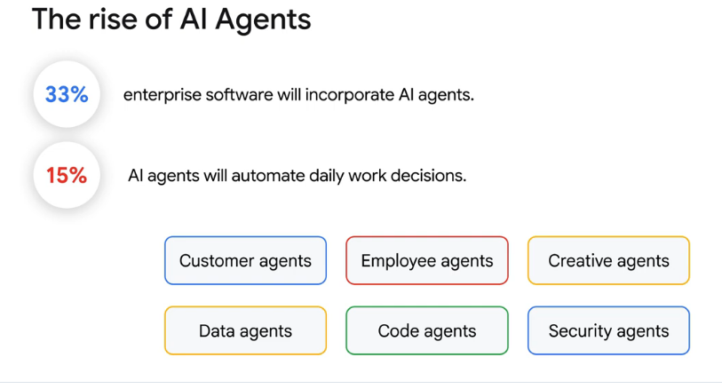
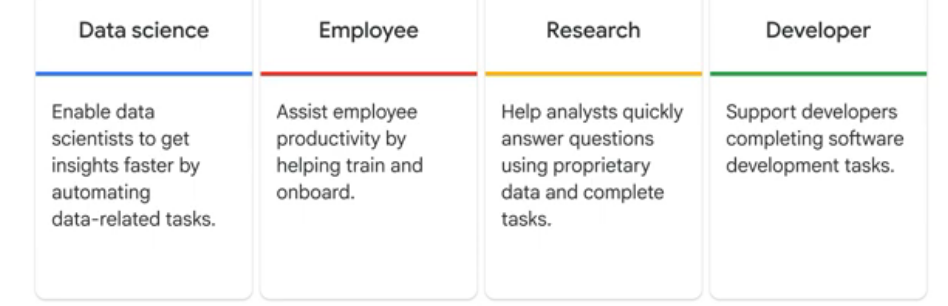
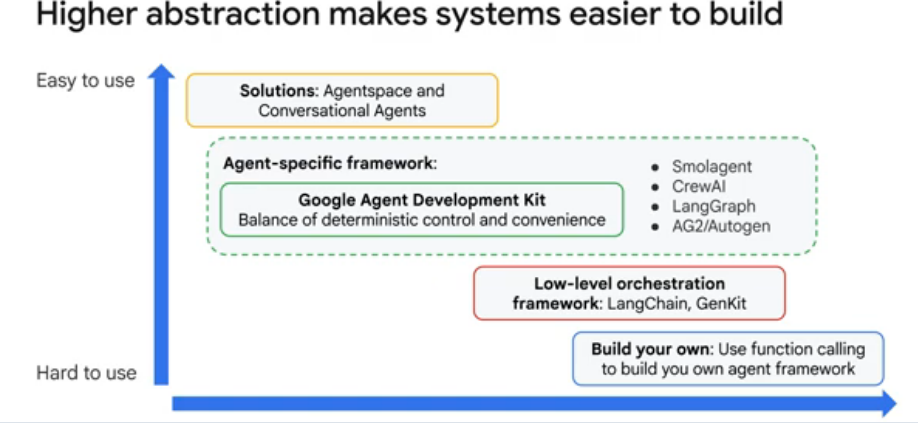
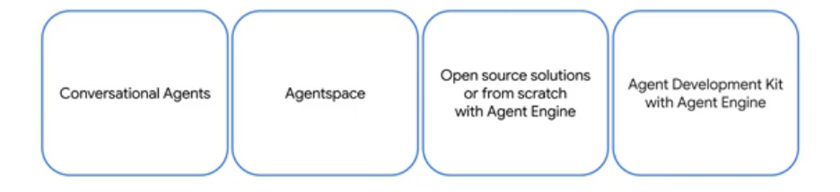
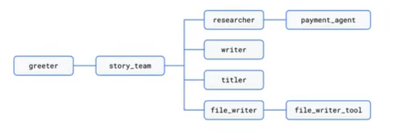
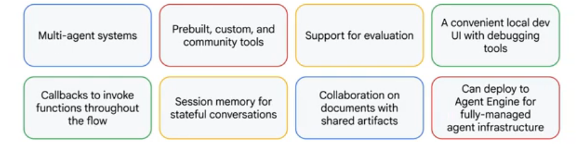
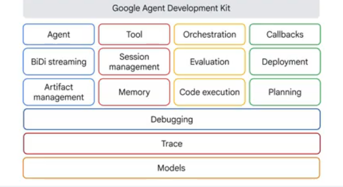
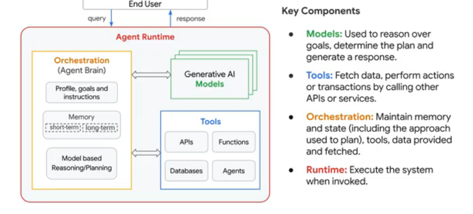

# Introduction to the Google Agent Development Kit (ADK)
(Source [Google Partner Skill Development Course](https://partner.skills.google/course_templates/1275))

<div align="left">

</div>

<!-- Google color palette
<font color="#4285F4">Blue</font> 
<font color="#EA4335">Red</font> 
<font color="#FBBC05">Yellow</font> 
<font color="#34A853">Green</font> 
<font color="#E37400">Orange</font>
<font color="#202124">Dark Gray</font>
<font color="#F1F3F4">Light Gray</font>
-->

## Introducing the Agent Development Kit (ADK)

AI Agents are poised for explosive growth in the coming years: By 2028, over 33% of enterprise software will incorporate
AI agents. AI agents will automate 15% of daily work decisions. This shift towards autonomous operations will
significantly transform businesses across all industries.

<div align="center">

</div>


**AI Agents are interactive partners that help answer complex questions and complete tasks.** There are some key areas
where AI agents are already having a big impact.

<div align="center">

</div>

* AI agents enable data scientists to get insights faster by automating data-related tasks like creating datasets,
  spotting anomalies in data, and generating visualizations.
* They assist employee productivity by helping train and onboard, complete daily tasks such as underwriting, verifying
  claims, and processing returns.
* AI agents help research analysts quickly answer questions using proprietary data, such as summarizing research,
  recalling past events, and pointing human researchers towards useful lines of thinking.
* And they can help developers complete software development tasks, including designing systems, writing code, logging
  bugs, creating tickets, and debugging.

With Google Cloud, developers can build agents at their preferred level of abstraction.

### Ways to build Agents

There are a **range of methods for agent building** that range from highly customizable and flexible, which require more
effort

<div align="center">

</div>

* You can **build a bespoke custom agent framework**, completely built to your own specific needs, **using Vertex
  components** like function calling and Gemini.
* You can **build custom agents with** a low level orchestration framework, like **LangChain/LangGraph or GenKit**.
* Or you **can build an agent-specific framework, using the Google ADK**, for balance of deterministic control and
  convenience, providing more support, to allow you nearly as much freedom as lower-level tools, while making it much
  easier to build and evaluate complex multi-agent systems.
* Or you could use other agentic frameworks, such as Smolagent, Crew AI, AG2 or Autogen.
* Finally, you have the **out-of-the box solutions, such as Agentspace and Conversational Agents**, which are very easy
  to use, but offer much less flexibility.

### Paths to build Agents on the GCP

Google Cloud provides four key paths for building an agent.

<div align="center">

</div>

| GCP Path                                                  | Details                                                                                                                                                |
|:----------------------------------------------------------|:-------------------------------------------------------------------------------------------------------------------------------------------------------|
| **Customer Engagement Suite, with Conversational Agents** | Use when you want external-facing conversational agents that can integrate with human support teams and existing telephony and communication platforms |
| **Agentspace** | Use when you want internal search to accelerate knowledge exchange throughout your organization, across your drives, chat, mail, ticketing platforms, databases, and more, including AI assistant support |
| **Open source frameworks or from scratch with Agent Engine** | Use when you want to  build something custom, you can use basic building blocks and start building from the ground up, for example, with the Google Gen AI SDK or LangChain, where you will also need to make decisions about infrastructure and hosting.|
| **ADK with Agent Engine** | Use when you want the freedom of custom development with support for communication between agents through conversation history and shared state. |

The Agent Development Kit makes it easier to build multi-agent systems, while handling challenges of agent communication for you. It also frees you from infrastructure decisions through deployment to Agent Engine, a fully managed runtime, so you can focus on building logic and interactions between agents while resources are allocated and autoscaled for you.

### Who is the ADK designed for?

* Designed for developers, who can create agents within their applications, with a code-centric approach, and no AI expertise required.
* Designed to empower developers to build, manage, evaluate and deploy AI-powered agents.
* The ADK is a client-side Python SDK, enabling developers to quickly build and customize multi-agent systems.
* ADK’s multi-agent systems allow a parent agent to steer the flow to various sub agents to complete different, specialized tasks as required.

<div align="center">

</div>

## Introducing the Agent Development Kit (ADK)

<div align="center">

</div>

The ADK offers several key advantages for developers building agentic applications: What makes this special is it’s much easier for multi-agent collaboration.

* With **multi-agent systems** you can easily build applications composed of multiple, specialized agents arranged hierarchically.
* There are **several pre-built, custom and community tools** that give agents abilities beyond conversation, letting them interact with external APIs, search information, run code, or call other services. With the ADK's open system, we can easily integrate tools from other popular agent frameworks (like LangChain, and CrewAI), leveraging existing investments and community contributions.
* ADK also **makes evaluation easier**.
* It **provides** a convenient, user-friendly local development user interface, with **tools to help debug your agents and multi-agent systems**.
* The ADK **provides callbacks** that can be used to invoke functions during various stages of a flow.
* **Provides session memory for stateful conversations**, which enables agents to recall information about a user across multiple sessions, providing long-term context (in addition to short-term session State).
* It **integrates artifact storage** to facilitate agent collaboration on documents.
* And, it **can be deployed to Agent Engine, for fully-managed agent infrastructure**.

## Developing Agents with the ADK

The Google ADK is built around a few key primitives and concepts that make it powerful and flexible:

<div align="center">

</div>


* **The Agent is the fundamental worker unit designed for specific tasks**.  Agents can **use language models for complex reasoning, or to act as controllers to manage workflows**. Agents **can coordinate complex tasks, delegate sub-tasks using LLM-driven transfer, or explicit Agent Tool invocation**, enabling modular and scalable solutions. With **native streaming support, you can build real-time, interactive experiences** with native support for bi-directional streaming, with text and audio. **Integrates seamlessly with underlying capabilities like the Gemini Live API**, often enabled with simple configuration changes. **Artifact Management allows agents to save, load, and manage versioned artifacts, files or binary data**, like images, documents, or generated reports, associated with a session or user, during their execution.
* Google ADK **provides a rich tool ecosystem, which equips agents with diverse capabilities**. It supports integrating custom functions, using other agents as tools, leveraging built-in functionalities like code execution, and interacting with external data sources and APIs. Support for long-running tools allows handling asynchronous operations effectively. There is also integrated developer tooling, so that you can develop and iterate locally with ease. ADK includes tools like a command-line interface (CLI) [`adk run`] and a Web UI [`adk web`] for running agents, inspecting execution steps, debugging interactions, and visualizing agent definitions. **Session Management for session and state handles the context of a single conversation** (the Session), including its history (as Events) and the agent’s working memory for that conversation (the State). An Event is the basic unit of communication representing things that happen during a session (such as user message, agent reply, and tool use), forming the conversation history. And **Memory enables agents to recall information about a user across multiple sessions**, providing long-term context, this is distinct from short-term session State.
* ADK **provides flexible orchestration that enables you to define complex agent workflows using built-in workflow agents alongside LLM-driven dynamic routing**. This allows for both predictable pipelines and adaptive agent behavior. As part of this orchestration Google ADK **uses a Runner**, which is the engine that manages the execution flow, orchestrates agent interactions based on Events, and coordinates with backend services. The ADK **has built-in Agent evaluation**, which means you can assess agent performance systematically. The **framework includes tools to create multi-turn evaluation datasets, and run evaluations locally**, through the CLI or UI, to measure quality and guide improvements. And **Code Execution provides the ability for agents (usually using Tools) to generate and execute code**, to perform complex calculations or actions.
* **Callbacks** are custom code snippets you provide to run at specific points in the agent's process, **allowing for checks, logging, or behavior modifications**. Google **ADK deploys to Agent Engine, a fully managed Google Cloud service** enabling developers to deploy, manage, and scale AI agents in production. Agent Engine handles the infrastructure to scale agents in production, so you can focus on creating intelligent and impactful applications. **Planning**, is an advanced **capability where agents can break down complex goals into smaller steps and plan how to achieve them** like a ReACT planner.
* As part of the interactive developer tooling, Google **ADK provides you tools to help debug your agents, interactions and multi-agent systems**. Your application traces will be collected by Cloud Trace, a tracing system that collects latency data from your distributed applications and displays it in the Google Cloud console. **Cloud Trace can capture traces from applications deployed on Agent Engine**, and it can help you debug the different calls performed between your LLM agent and its tools, before returning a response to the user. Finally, **models are the underlying Large Language Models**, like Gemini, or Claude, that power ADKs LLM Agents, enabling their reasoning, and language understanding abilities. Though optimized for Gemini models, the ADK framework can work with all popular LLMs, including open-sourced LLMs.

### Components of an Agent

An agent can execute the steps of a certain workflow to accomplish a goal, and can access any required external systems and tools to do so. There are **4 main components of an agent**:

<div align="center">

</div>

* The <font color="#34A853">**models**</font> are used to reason over goals, determine the plan and generate a response. An ADK agent can use multiple models.
* <font color="#4285F4">**Tools**</font> are used to fetch data, perform actions or transactions by calling other APIs or services.
* <font color="#FBBC05">**Orchestration**</font> is the mechanism for configuring the steps required to complete a task, and the logic for processing over these steps, and accessing the required tools. It _maintains memory and state, including the approach used to plan, and any data provided or fetched, as well as the necessary tools_.
* And the <font color="#EA4335">**runtime**</font> is used to execute the system when invoked after receiving a query from an end user.

### Configuring the ADK

In this section, we'll discuss how to configure a local Python environment to develop agents with the ADK, and different ways to run your agents.

Let's assume that we'll be developing all our ADK projects in sub-folders of the `~/adk_projects` folder on a Mac or Linux machine (or `c:\adk_projects` on Windows). Also, we'll assume that you are managing your local Python environments using `uv`, and it is installed on your machine. For `uv` installation instructions [follow this link](https://docs.astral.sh/uv/getting-started/installation/).

#### Create a Virtual environment
* Open your terminal and navigate to the `~/adk_projects` (or `c:\adk_projects`) folder.
* Run the following command to create the virtual environment **and activate it** - it is important that you activate your local environment before installing any packages.

```bash
# creates a local Python environment with Python >= 3.10
# replace 3.10 in command below with your preferred version
$ ~/adk_projects> uv init --python 3.10
Initialized project `adk-projects`

# above command will create 3 files in ~/adk_projects
# main.py, readme.md and pyproject.toml

# now initialize the virtual env in a .venv sub-folder (IMP)
$ ~/adk_projects> uv venv .venv
Using CPython 3.12.11
Creating virtual environment at: .venv
Activate with: source .venv/bin/activate

# activate your local environment
$ ~/adk_projects> source .venv/bin/activate  # on Mac/Linux
OR
$ c:\adk_projects> source .venv/Scripts/activate  # on Windows

# you should see a changed prompt like the one below
(.venv)
$ ~/adk_projects>
```
* Install the `google_adk` package in your newly created & activated Python environment as follows

```bash
(.venv)
$ ~adk_projects> uv add google_adk
# will install several packages....
```

* To test that `google_adk` is available in the local environment, type `adk --version` on the command line. If it shows the adk version (may take some time), then you are all set!

```bash
(.venv)
$ ~adk_projects> adk --version
adk, version 2.3.0
```

#### ADK project directory structure

* Each ADK project **MUST BE** created in it's own sub-directory. Suppose our new project is to be created in the `welcome_agent` sub-folder off `~/adk_projects` parent folder, here is the directory structure (and recommended file naming conventions)

```
~/adk_projects/
├── .venv/                      # Your local virtual environment (we just created using uv commands)
├── pyproject.toml              # Managed by uv (your dependencies - uv add ... commands will update this file)
│
└── welcome_agent/              # Your main agent module directory
    ├── __init__.py             # Exposes the agent and configurations
    ├── .env                    # Hidden file that contains your LLM API key & other globals
    ├── agent.py                # Defines the main Agent object and its instructions
    ├── tools.py                # (Optional) contains Python functions the agent can use as tools
    ├── workflows.py            # (Optional) Maps out multi-agent graph flows
    └── main.py                 # local test script runner / application entry point
```

#### Creating your first agent
* Create the `welcome_agent`, `.env` file and `agent.py` in the above folder structure
* Open `agent.py` in your favourite IDE or editor and type in the following code

```python
from dotenv load_dotenv

from google.adk.agents import Agent

root_agent = Agent(
  name="welcome_agent",
  model="gemini-3.1-flash-lite',
  description="Greeter agent",
  instruction="""
    You are a friendly assistant that greets the user and responds to their queries
  """,
)
